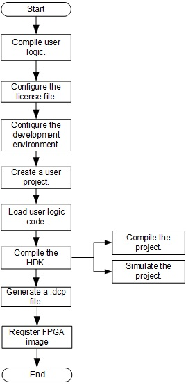
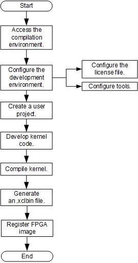

# FPGA Development Suite
[切换到中文版](./README_CN.md)

# Contents

+ [1 FP1-based FPGA Development Suite](#sec_1)
  + [1.1 Overview](#sec_1_1)
  + [1.2 Preparations](#sec_1_2)
+ [2 FPGA Development Guide for High-Performance Architecture](#sec_2)
  + [2.1 Hardware Development Process](#sec_2_1)
  + [2.2 Software Development Process](#sec_2_2)
  + [2.3 Using a Vivado-based Example](#sec_2_3)
+ [3 FPGA Development Guide for General-Purpose Architecture](#sec_3)
  + [3.1 Hardware Development Process](#sec_3_1)
  + [3.2 Software Development Process](#sec_3_2)
  + [3.3 Using an SDAccel-based Example](#sec_3_3)

# 1 FP1-based FPGA Development Suite

## 1.1 Overview
The FP1-based FPGA development suite is a cloud FPGA hardware/software development kit based on Huawei enterprise cloud services. This suite helps users to design, simulate, implement, and one-click compilation run on FPGA, and provides professional design and verification components to help users efficiently implement FPGA development. The suite provides tools for hardware and software development, respectively. The hardware development suite helps users to complete project compilation, simulation, generate the .dcp or .xclbin file， and register an FPGA image. The software development suite guides users to load an FPGA image, and compile and debug user applications.

## 1.2 Preparations
Before using the FPGA development suite, download the suite, modify the configuration file, and configure an FPGA Accelerated Cloud Server (FACS) image. The hardware development tools are stored in the [hardware](./fp1/hardware) directory, including Vivado and SDAccel development tools. The software development tools are stored in the [software](./fp1/software) directory, including configure files, drivers, tools, and related applications which are needed when running instances. 

### 1.2.1 Downloading Suite

+ For HTTPS connections, run the `git clone https://github.com/Huawei/huaweicloud-fpga.git` command to download the suite.

+ For SSH connections, run the `git@github.com:Huawei/huaweicloud-fpga.git` command to download the suite.

> Ensure that the Git tool is installed before downloading the development suite.

### 1.2.2 Modifying the Configuration File and Configuring an FACS Image
#### Step 1: Compile and install the FPGA image management tool
The fisclient is a cross-platform command-line interface (CLI) tool used for FPGA image management, which is mandatory before FPGA image loading. By using fisclient, you can register, delete, and query FPGA images (AEIs), or manage the association between AEIs and elastic cloud server (ECS) images. You can associate an AEI with an ESC image, and release the AEI to the cloud market or share it with other users through the ESC image.

For details, please see the chapter of installation in [fisclient README](./cli/fisclient/README.md).
### step 2: Modifying the Configuration File and Configuring an FACS Image
Before registering and querying an FPGA image, modify the configuration file and configure an FACS image. For details, visit: [http://support.huaweicloud.com/usermanual-fpga/zh-cn_topic_0069154765.html](http://support.huaweicloud.com/usermanual-fpga/zh-cn_topic_0069154765.html).

# 2 FPGA Development Guide for High-Performance Architecture
When a high-performance architecture is used, the FPGA development is divided to three scenarios: hardware development, software development, and example using. During hardware development, you can generate and register an FPGA image by using the Vivado tools. During software development, you can develop applications based on the existing FPGA image. By using examples, you can quickly master the FPGA development process under the current server architecture.

+ [2.1 Hardware Development Process](#sec_2_1)
+ [2.2 Software Development Process](#sec_2_2)
+ [2.3 Using a Vivado-based Example](#sec_2_3)

## 2.1 Hardware Development Process
When a high-performance architecture FACS is used, the FPGA hardware development is based on the Vivado tools. This development process guides users to create, compile, and simulate a project, generate a .dcp file, and register an FPGA image (AEI, Accelerated Engine Image). After the hardware development, if you need to develop your own applications based on the registered FPGA image, see section [2.2](#sec_2_2).

### 2.1.1 Generating a DCP File
For details about how to develop a .dcp file based on the Vivado, see [Vivado-based Hardware Development Process](./fp1/docs/Implementation_Process_of_Vivado_based_Hardware_Development.md).

### 2.1.2 Registering an FPGA Image
Before registering an FPGA image, if you have not installed this tool yet, please install the image management tool fisclient by referring to section [1.2.2](#sec_1_2_2).

#### Step 1: Register an FPGA image
You can use AEI_Register.sh to register an FPGA image with the image management module. After the registration, an ID is assigned to the FPGA image. Please record this ID, because it can be used to query the registration status, and load, delete, and associate the image.

[Registering an FPGA Image](./fp1/docs/Register_an_FPGA_image_for_a_DPDK_project.md)

#### Step 2: Query the FPGA image
After configuring the files, run the `fisclient` command on the Linux shell to go to the fisclient login screen and enter the HWS account password when prompted. On the fisclient CLI, you can run corresponding commands to query, delete, or associate FPGA images.

For details about how to use the fisclient to query the FPGA image, see [fisclient README](./cli/fisclient/README.md).

## 2.2 Software Development Process
After hardware development and FPGA image registration, you can develop FPGA user applications by referring to this section.

### 2.2.1 Load the FPGA Image
After an FPGA image is registered, use the FPGA image loading tool FpgaCmdEntry to load the image to the FPGA before software development.

#### Step 1: Compiling and Installing the FPGA Image Loading Tool 	
The FPGA image loading tool FpgaCmdEntry is a command-line interface (CLI) tool, which supports FPGA information query, image loading and query, and virtual LED status query. 

For details, please see the chapter of compiling and installing in [fpga_tool README](./fp1/tools/fpga_tool/README.md).

#### Step 2: Load the FPGA Image
For details, see the following file.

[load an fpga image](./fp1/tools/fpga_tool/docs/load_an_fpga_image.md)

> For more details of loading tool, see [fpga_tool README](./fp1/tools/fpga_tool/README.md). 

### 2.2.2 Compiling and debugging User Applications
The high-performance architecture development mode uses the DPDK architecture to exchange data between the FPGA and the processors. For details about how to compile and debug user applications, see [DPDK-based User Applications Development Descriptions](./fp1/software/app/dpdk_app/README.md).
If you need to modify the driver, refer to [DPDK-based Driver Development Descriptions](./fp1/software/userspace/dpdk_src/README.md).

### 2.2.3 Running User Applications

After the FPGA image loading and application compilation, you can go to the [huaweicloud-fpga/fp1/software/app/dpdk_app/bin](./fp1/software/app/dpdk_app/bin) directory to run user applications.

## 2.3 Vivado-based Example
For high-performance server architectures, FAC services provide three examples. Example 1 implements user logic version reading, data inversion, and addition functions. Example 2 implements user logic DMA (Direct Memory Access) loopback channels and DDR (DDR SDRAM) read functions. Example 3 implements user logic FPGA memory manage unit (FMMU) function. The following figure shows the Vivado-based example operation process.

For details, see [Using a Vivado-based Example](./fp1/docs/Using_a_Vivado_based_Example.md).

# 3 FPGA Development Guide for General-Purpose Architecture
When a general-purpose architecture is used, the FPGA development is divided to three scenarios: hardware development, software development, and example using. During hardware development, you can generate and register an FPGA image by using the SDAccel tools. During software development, you can develop applications based on the existing FPGA image. By using examples, you can quickly master the FPGA development process under the current server architecture.

+ [3.1 Hardware Development Process](#sec_3_1)
+ [3.2 Software Development Process](#sec_3_2)
+ [3.3 Using an SDAccel-based Example](#sec_3_3)

## 3.1 Hardware Development Process
When a general-purpose architecture is used, the hardware development is based on the SDAccel tools. This development process guides users to create, compile, and simulate a project, generate an .xclbin file, and register an FPGA image (AEI). After the hardware development, if you need to develop your own applications based on the registered FPGA image, see section [3.2](#sec_3_2).

### 3.1.1 Generating an .xclbin File
For details about how to develop an .xclbin file based on the SDAccel, see [SDAccel-based Hardware Development Process](./fp1/docs/Implementation_Process_of_SDAccel_based_Hardware_Development.md).

### 3.1.2 Registering an FPGA Image
Before registering an FPGA image, if you have not installed this tool yet, please install the image management tool fisclient by referring to section [1.2.2](#sec_1_2_2). After the installation, you can use AEI_Register.sh to register an FPGA image with the image management module. For details about how to register an FPGA image, see [Registering an FPGA Image](./fp1/docs/Register_an_FPGA_image_for_an_OpenCL_project.md). After the registration, an ID is assigned to the FPGA image. Please record this ID, because it can be used to query the registration status, and load, delete, and associate the image.

> You can run the Fisclient command to query the registration result. For details, see step 2 in section [2.1.2](#sec_2_1_2).

## 3.2 Software Development Process

After hardware development and FPGA image registration, you can develop FPGA user applications by referring to this section.

### 3.2.1 Loading the FPGA Image
Loading the FPGA image is required before FPGA software development. For details about how to load the FPGA image, see section [2.1.1](#sec_2_2_1).

### 3.2.2 Compiling and debugging User Applications
The general-purpose architecture development mode uses the Xilinx SDAccel architecture to exchange data between the FPGA and the processors. For details about how to compile and debug user applications, see [SDAccel-based User Applications Development Descriptions](./fp1/software/app/sdaccel_app/README.md).
If you need to modify the HAL, see the [SDAccel Mode HAL Development Descriptions](./fp1/software/userspace/sdaccel/README.md).

### 3.2.3 Running User Applications

After the FPGA image loading and application compilation, you can go to the [huaweicloud-fpga/fp1/software/app/sdaccel_app](./fp1/software/app/sdaccel_app) directory to run user applications

## 3.3 SDAccel-based Example
When a general-purpose architecture is used, the Huawei FAC services provide three examples. Example 1 is an example of vector addition using OpenCL C to implement the logic algorithm. Example 2 is an example of matrix multiplication using C to implement the logic algorithm. Example 3 is an example of vector addition using RTL to implement the logic function. The following figure shows the SDAccel-based example operation process.

For details, see [Using an SDAccel-based Example](./fp1/docs/Using_an_SDAccel_based_Example.md).

\----End
