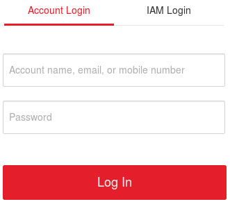
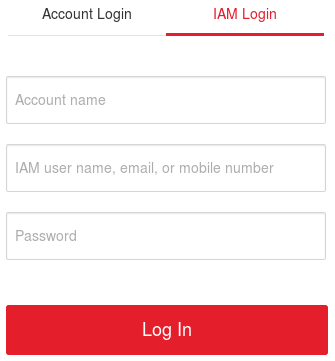

# fisclient #
[切换到中文版](README_CN.md)  
**fisclient** is a command-line client for FIS (FPGA Image Service) that brings the command set for FPGA image management together in a single shell.

- [1 Operating Environment Requirements](#1-operating-environment-requirements)
- [2 Installation](#2-installation)
- [3 Configuration](#3-configuration)
- [4 Introduction](#4-introduction)
  - [4.1 Commands](#41-commands)
  - [4.2 Exit upon Timeout](#42-exit-upon-timeout)
  - [4.3 Logs](#43-logs)
- [5 Application Scenario](#5-application-scenario)
  - [5.1 Querying FPGA Images](#51-querying-fpga-images)
  - [5.2 Deleting an FPGA Image](#52-deleting-an-fpga-image)
  - [5.3 Associating and Disassociating FPGA Images, and Querying Associations](#53-associating-and-disassociating-fpga-images-and-querying-associations)
- [6 fis Command Description](#6-fis-command-description)
  - [6.1 Viewing Help Information](#61-viewing-help-information)
  - [6.2 Deletion Subcommand](#62-deletion-subcommand)
  - [6.3 Query Subcommand](#63-query-subcommand)
  - [6.4 Association Subcommand](#64-association-subcommand)
  - [6.5 Disassociation Subcommand](#65-disassociation-subcommand)
  - [6.6 Association Query Subcommand](#66-association-query-subcommand)
- [7 Region-Specific Parameters](#7-region-specific-parameters)

# 1 Operating Environment Requirements #
**fisclient** is developed and tested in the following environments:

- CentOS 7.3
- Python 2.7

For other environments, availability is not guaranteed.

# 2 Installation #
You should first make sure that you have logged in to the Elastic Cloud Server as **root** before installation.

### Step 1. Bound the Elastic IP ###
- See [Assigning an EIP and Binding It to an ECS](http://support.huaweicloud.com/en-us/usermanual-vpc/en-us_topic_0013748738.html) for how to bind Elastic IP to the Elastic Cloud Server.

### Step 2. Download the source package ###
- Run the **git clone https://github.com/Huawei/huaweicloud-fpga.git** command to download the **fisclient** source package.

> Ensure that there is not any file or directory named **huaweicloud-fpga** in the current directory. 

### Step 3. Install the fisclient ###
- Run the **cd huaweicloud-fpga/cli/fisclient** command to switch to the **huaweicloud-fpga/cli/fisclient** directory.

- Run the **bash install.sh** command to install the **fisclient**.

> The dependencies of **fisclient** will installed during the installation, please be patient.

# 3 Configuration #
Run the **fisconfig** command on the Linux shell to configure the **fisclient**. During the configuration, you need to enter the following parameters:

| Parameter | Description |
| --------- | ----------- |
| **IAM Endpoint** | Endpoint of the IAM service |
| **FIS Endpoint** | Endpoint of the FIS service |
| **Project Name** | Project name |
| **Account User Name** | Account user name |

### Step 1. Configure the Region-Parameters ###
The **IAM Endpoint**, **FIS Endpoint** and **Project Name** parameters are related to your current **region**, you can get these parameters in [Region-Specific Parameters](#region-specific-parameters).  
For example, these parameters should be configured as follows if you are in the **CN North-Beijing1**.

| Parameter | Value |
| --------- | ----- |
| **IAM Endpoint** | iam.cn-north-1.myhuaweicloud.com |
| **FIS Endpoint** | ecs.cn-north-1.myhuaweicloud.com |
| **Project Name** | cn-north-1 |

### Step 2. Configure the User-Parameters ###
The **Account User Name** parameters are related to how you log in to Huawei Cloud.

- Account Login

If you are logged in by **Account Login**, the **Account User Name** should be configured to your account name. For example, if your account name is hwaccount, then the **Account User Name** parameter should be set to **hwaccount**.

 

- IAM Login

If you are logged in by **IAM Login**, the **Account User Name** should be configured to your account name and user name. The format is "account name,user name" (separated by comma). For example, if your account name is hwaccount and your user name is hwuser, then the **Account User Name** parameter should be set to **hwaccount,hwuser**.

> If you do not log in to Huawei cloud as account name or user name, please refer to [Viewing Security Credentials](https://support.huaweicloud.com/en-us/usermanual-iam/en-us_topic_0079477133.html) to get your account name and user name.

### Step 3. Verify and Save ###
After the configuration, enter your **huaweicloud password** when prompted. If the parameters are verified successfully, **fisclient** will save these configurations to the **~/.fiscfg** file.

# 4 Introduction #
After the [configuration](#configuration), run the **fisclient** command on the Linux shell to go to the fisclient login screen and enter the **huaweicloud account password** when prompted. On the fisclient CLI, you can run corresponding commands to query, delete, associate, disassociate FPGA images and query associations.
<pre>
[root@ ~]# fisclient
Please input the password of "hc***user": 
[fisclient] > 
</pre>

## 4.1 Commands ##
The fisclient CLI supports two types of commands, **fis** and **quit**.

**fis** commands are used for FPGA image management. For example, to delete an FPGA image, run the following command:
<pre>
[fisclient] > fis fpga-image-delete --fpga-image-id 000000005d19********30dc17ab02ab --force
Success: 204 No Content
</pre>
- **fpga-image-delete** is the subcommand to delete an FPGA image.
- **--fpga-image-id** and **--force** are command options of the deletion subcommand. **--fpga-image-id** specifies of the ID of the FPGA image to be deleted, for example, **000000005d19\*\*\*\*\*\*\*\*30dc17ab02ab**. **--force** indicates that the FPGA image can be deleted without user confirmation.

For details about how to use the fis commands, see [fis command Description](#fis-command-description).

**quit** exits the fisclient CLI.
<pre>
[fisclient] > quit 
[root@ ~]#
</pre>

## 4.2 Exit upon Timeout ##
If no operation is performed on the fisclient CLI within **3600** seconds, fisclient will automatically exit.
<pre>
[fisclient] > 
time out, please press Enter to exit
[root@ ~]#
</pre>

## 4.3 Logs ##
fisclient saves IAM and fis service access records in logs in the **/var/log/fiscli/** directory. The logs are named by date. For example, 2017_09_01.log records user access on September 1, 2017.
 
The Log information is recorded in the format of **Time User Operation Result**. Examples:
<pre>
[2017-09-01-08-58-48] user [hc***user cn-north-1] get_token Success, Created. (HTTP 201)
</pre>
The preceding information indicates that the user hc\*\*\*user passed the authentication and accessed the IAM service to obtain the token at 8:58:48 on September 1, 2017 in the cn-north-1 region.
<pre>
[2017-09-01-15-34-40] user [hc***user cn-north-1] do_fpga_image_list {"page": "1", "size": "8"}, Success, 200 OK
</pre>
The preceding information indicates that the user hc\*\*\*user queried the FPGA image list at 15:34:40 on September 1, 2017 in the cn-north-1 region. **page** was set to **1** and **size** was set to **8**. The tenant successfully accessed the fis service and queried the FPGA image list.

# 5 Application Scenario #
## 5.1 Querying FPGA Images ##
After registering an FPGA image, you can use the fis query subcommand to query information about FPGA images owned by youself. After the **status** of an FPGA image changes to **active**, you can use the corresponding FPGA image ID to load, delete, and associate the FPGA image. 

> With the fis query subcommand, you can only query information about **FPGA images owned by youself**. For purchased and shared FPGA images, you should use the **fis association query subcommand**. For example, you can refer to [Querying the Shared FPGA Image](#querying-the-shared-fpga-image) to learn how to query the shared FPGA images.

The fis query subcommand displays FPGA image information in a table, and also supports pagination query. For more details, see [Query Subcommand](#query-subcommand).

### Example ###
Run the following command to query FPGA images:
<pre>
[fisclient] > fis fpga-image-list
Success: 200 OK
+----------------------------------+---------+--------+-----------+------+---------------------+-------------+---------------------------------------------------------------------------------------------------------------------------------------------------------------------------------------------------------------------------------------------------------------+---------+
| id                               | name    | status | protected | size | createdAt           | description | metadata                                                                                                                                                                                                                                                      | message |
+----------------------------------+---------+--------+-----------+------+---------------------+-------------+---------------------------------------------------------------------------------------------------------------------------------------------------------------------------------------------------------------------------------------------------------------+---------+
| 000000******08b4015e3224afe203c3 | OCL_001 | active | False     | 43   | 2017-09-19 02:27:31 | mmult_01    | {"manifest_format_version": "1", "pci_vendor_id": "0x19e5", "pci_device_id": "0xD512", "pci_subsystem_id": "-", "pci_subsystem_vendor_id": "-", "shell_type": "0x121", "shell_version": "0x0001", "hdk_version": "SDx 2017.1", "date": "2017/09/17_18:37:12"} |         |
+----------------------------------+---------+--------+-----------+------+---------------------+-------------+---------------------------------------------------------------------------------------------------------------------------------------------------------------------------------------------------------------------------------------------------------------+---------+
</pre>
- The ID of the FPGA image is **000000\*\*\*\*\*\*08b4015e3224afe203c3**.
- The state of the FPGA image is **active**, indicating that image has been registered successfully.

Therefore, you can use the ID of the FPGA image to load, delete, or associate the FPGA image.

## 5.2 Deleting an FPGA Image ##
An FPGA image can be deleted only by its owner. If a registered FPGA image is no longer used and you want to delete the FPGA image record from the FPGA image management module, you can run a fis deletion subcommand to delete it. In addition, if the **status** of an FPGA image is **error**, you can also use the fis deletion subcommand to delete the FPGA image record. If an FPGA image has been associated with an ECS image, the FPGA image will be **protected** (the value of **protected** is **True**) and cannot be deleted. For more details, see [Deletion Subcommand](#deletion-subcommand).

### Confirming the Deletion ###
fisclient provides the deletion confirmation function. You need to enter **yes** or **no** to decide whether to perform the deletion.

- **yes** executes the deletion operation.
- **no** cancels the deletion operation.

<pre>
[fisclient] > fis fpga-image-delete --fpga-image-id 4010b39d********015d5ee5c3b00501
Deleted fpga-image cannot be restored! Are you absolutely sure? (yes/no): no
cancel fpga-image-delete
[fisclient] > fis fpga-image-delete --fpga-image-id 4010b39d********015d5ee5c3b00501
Deleted fpga-image cannot be restored! Are you absolutely sure? (yes/no): yes
Success: 204 No Content
</pre>
If you do not want to confirm the deletion operation each time you run the fis deletion command, you can specify the **--force** option to forcibly perform the deletion operation.

### Example ###
The output of an FPGA image query operation is as follows:
<pre>
+----------------------------------+----------+--------+-----------+------+---------------------+-------------+-------------------------------------------------------------------------------------------------------------------------------------------------------------------------------------------------------------------------------------------------------------------------------------------------------------------------------------------------------------------------------------------+----------------------------+
| id                               | name     | status | protected | size | createdAt           | description | metadata                                                                                                                                                                                                                                                                                                                                                                                  | message                    |
+----------------------------------+----------+--------+-----------+------+---------------------+-------------+-------------------------------------------------------------------------------------------------------------------------------------------------------------------------------------------------------------------------------------------------------------------------------------------------------------------------------------------------------------------------------------------+----------------------------+
| ff********5056b2015d5e13608c73c7 | OCL_001  | active | False     | 43   | 2017-09-19 02:27:31 | mmult_01    | {"manifest_format_version": "1", "pci_vendor_id": "0x19e5", "pci_device_id": "0xD512", "pci_subsystem_id": "-", "pci_subsystem_vendor_id": "-", "shell_type": "0x121", "shell_version": "0x0001", "hdk_version": "SDx 2017.1", "date": "2017/09/18_18:27:12"}                                                                                                                             |                            |
| 4010b39c5d4********48e97411005ae | dpdk_002 | error  | False     | 45   | 2017-09-19 16:39:27 | example_02  | {"manifest_format_version": "1", "pci_vendor_id": "0x19e5", "pci_device_id": "0xD503", "pci_subsystem_id": "-", "pci_subsystem_vendor_id": "-", "dcp_hash": "ced75657********60f212a9454f6c5ae33d50f0a248e99dbef638231b26960c", "shell_type": "0x101", "shell_version": "0x0013", "dcp_file_name": "ul_pr_top_routed.dcp", "hdk_version": "Vivado 2017.2", "date": "2017/09/19_13:51:41"} | register fpga image failed |
+----------------------------------+----------+--------+-----------+------+---------------------+-------------+-------------------------------------------------------------------------------------------------------------------------------------------------------------------------------------------------------------------------------------------------------------------------------------------------------------------------------------------------------------------------------------------+----------------------------+
</pre>
Perform the following commands to delete the FPGA image no longer used (ID: **ff\*\*\*\*\*\*\*\*5056b2015d5e13608c73c7**), and the FPGA image that fails to be registered (ID: **4010b39c5d4\*\*\*\*\*\*\*\*48e97411005ae**):

- Delete the FPGA image no longer used.
<pre>
[fisclient] > fis fpga-image-delete --fpga-image-id ff********5056b2015d5e13608c73c7 --force
Success: 204 No Content
</pre>

- Delete the FPGA image in the error state.
<pre>
[fisclient] > fis fpga-image-delete --fpga-image-id 4010b39c5d4********48e97411005ae --force
Success: 204 No Content
</pre>

In these commands, **--fpga-image-id** specifies the ID of the FPGA image to be deleted, **--force** specifies a forcible deletion operation. If the command output is **Success: 204 No Content**, the fis deletion subcommand is executed successfully. 
However, the execution success of the deletion subcommand does not necessarily mean that the FPGA image is deleted successfully. You need to perform the query operation. If information about the FPGA image to be deleted is not displayed, the FPGA image has been deleted successfully.

## 5.3 Associating and Disassociating FPGA Images, and Querying Associations ##
By associating a registered FPGA image, you can share the FPGA image with other users in the following two scenarios:

- Marketing Scenario: Publishing the FPGA image in the cloud market for transaction
- Sharing Scenario: Sharing the FPGA image with a specified user

By querying associations, you can query the FPGA images provided by other users. By disassociating an FPGA image, you can stop sharing the FPGA image with other users.  
This section uses the FPGA image sharing scenario as an example to describe how to associate or disassociate an FPGA image, and query associations. For more details about these subcommands, see [Association Subcommand](#association-subcommand), [Disassociation Subcommand](#disassociation-subcommand) and [Association Query Subcommand](#association-query-subcommand).

### Sharing the FPGA Image ###
If user A wants to share a self-owned registered FPGA image with user B, user A needs to perform the following steps. The following assumes that user A wants to share the **general-purpose architecture** FPGA image whose ID is **4010b39c5d4\*\*\*\*\*\*\*\*\*\*f2cf8070c7e** with user B.

- Step 1. Create a private ECS image from an **general-purpose architecture** FPGA Elastic Cloud Server. For more details, see [Creating a Private Linux Image](http://support.huaweicloud.com/en-us/usermanual-ims/en-us_topic_0030713180.html).
- Step 2. Obtain the image ID from the details page of the created private ECS image. The following assumes that the image ID of the created private ECS image is **404223ca-8\*\*b-4\*\*2-a\*\*e-d187\*\*\*\*61bc**.
- Step 3. Associate the FPGA image to be shared with the created private ECS image.

User A needs to log in to the FPGA Elastic Cloud Server, run the **fisclient** program, and run a fis association subcommand to associate the FPGA image with the private ECS image.
<pre>
[fisclient] > fis fpga-image-relation-create --fpga-image-id 4010b39c5d4**********f2cf8070c7e --image-id 404223ca-8**b-4**2-a**e-d187****61bc
Success: 204 No Content
</pre>
If **Success: 204 No Content** is displayed, the association is successful.
- Step 4. Share the created private ECS image with user B. For more details, see [Sharing Specified Images](http://support.huaweicloud.com/en-us/usermanual-ims/en-us_topic_0032042419.html).

> A private image will become a **shared** one after the sharing and cannot be used for association. Therefore, associate a private image before sharing it.

### Querying the Shared FPGA Image ###
If user B wants to use a registered FPGA image shared by user A, user B needs to perform the following steps.

- Step 1. Accept the ECS image shared by user A. For more details, see [Accepting the shared image](http://support.huaweicloud.com/en-us/usermanual-ims/en-us_topic_0032042420.html).
- Step 2. Obtain the type of the FPGA image from user A. In this example, it is **general-purpose architecture**.
- Step 3. Use the shared ECS image to create an FPGA Elastic Cloud Server with the same type as the shared FPGA image. For more details, see [Purchasing an ECS](https://support.huaweicloud.com/en-us/usermanual-ecs/en-us_topic_0021831611.html). In this example, user B needs to create an FPGA Elastic Cloud Server of **general-purpose architecture**.
> Ensure that the type of the created FPGA Elastic Cloud Server is the same with that of the shared FPGA image.

- Step 4. Obtain the image ID from the details page of the shared ECS image. In this example, it is **404223ca-8\*\*b-4\*\*2-a\*\*e-d187\*\*\*\*61bc**.
- Step 5. Query the FPGA image shared by user A using the image ID of the shared ECS image.

User B needs to log in to the FPGA Elastic Cloud Server created from the ECS image shared by user A, run the **fisclient** program, and run a fis association query subcommand (set the **image-id** parameter to the image ID of the shared ECS image) to check for the FPGA image shared by user A.
<pre>
[fisclient] > fis fpga-image-relation-list --image-id 404223ca-8**b-4**2-a**e-d187****61bc
Success: 200 OK
+--------------------------------------+----------------------------------+---------+--------+-----------+------+---------------------+-------------+----------------------------------------------------------------------------------------------------------------------------------------------------------------------------------------------------------------------------------------------------------------+---------+
| image_id                             | fpga_image_id                    | name    | status | protected | size | createdAt           | description | metadata                                                                                                                                                                                                                                                       | message |
+--------------------------------------+----------------------------------+---------+--------+-----------+------+---------------------+-------------+----------------------------------------------------------------------------------------------------------------------------------------------------------------------------------------------------------------------------------------------------------------+---------+
| 404223ca-8**b-4**2-a**e-d187****61bc | 4010b39c5d4**********f2cf8070c7e | name123 | active | True      | 39   | 2017-09-19 03:27:31 | desc123     |  {"manifest_format_version": "1", "pci_vendor_id": "0x19e5", "pci_device_id": "0xD512", "pci_subsystem_id": "-", "pci_subsystem_vendor_id": "-", "shell_type": "0x121", "shell_version": "0x0001", "hdk_version": "SDx 2017.1", "date": "2017/09/18_19:27:12"} |         |
+--------------------------------------+----------------------------------+---------+--------+-----------+------+---------------------+-------------+----------------------------------------------------------------------------------------------------------------------------------------------------------------------------------------------------------------------------------------------------------------+---------+
</pre>
The output shows that the ID of the FPGA image shared by user A shared is **4010b39c5d4\*\*\*\*\*\*\*\*\*\*f2cf8070c7e**. User B can use the ID for loading.

### Canceling the FPGA Image Sharing ###
If user A wants to stop sharing the FPGA image with user B, user A needs to perform the following operations:

- Step 1. Cancel the image sharing with user B. For more details, see [Canceling the Image Sharing](http://support.huaweicloud.com/en-us/usermanual-ims/en-us_topic_0032087324.html).
- Step 2. Disassociate the shared FPGA image from the private ECS image.

User A needs to log in to the FPGA Elastic Cloud Server, run the **fisclient** program, and run a fis disassociation subcommand to disassociate the shared FPGA image from the private ECS image.
<pre>
[fisclient] > fis fpga-image-relation-delete --fpga-image-id 4010b39c5d4**********f2cf8070c7e --image-id 404223ca-8**b-4**2-a**e-d187****61bc
Success: 204 No Content
</pre>
If **Success: 204 No Content** is displayed, the disassociation is successful.

# 6 fis Command Description #
## 6.1 Viewing Help Information ##
On the fisclient CLI, run the **fis help** command to view help information of fis commands and run the **fis help subcommand** command to view help information of fis subcommands.
<pre>
[fisclient] > fis help 
usage: fis &lt;subcommand&gt; ...

Command-line interface to the fis API. 

positional arguments: 
  &lt;subcommand&gt; 
    fpga-image-delete   Delete an FPGA image
    fpga-image-list     Query FPGA images of a tenant
    fpga-image-relation-create
                        Create the relation of an FPGA image and an ECS image
    fpga-image-relation-delete
                        Delete the relation of an FPGA image and an ECS image
    fpga-image-relation-list
                        Query FPGA image relations visible to a tenant
    help                Display help about fis or one of its subcommands

See "fis help COMMAND" for help on a specific command.
</pre>

The format of a fis command is **fis subcommand option**.

- **subcommand** specifies the function of the command.
- **option** is unique to the subcommand and specifies command parameters for the subcommand.

fis commands include six subcommands.

| Command | Description |
| ------- | ----------- |
| **fpga-image-delete** | Deletion subcommand, used to delete an FPGA image. |
| **fpga-image-list** | Query subcommand, used to query FPGA images of a tenant. |
| **fpga-image-relation-create** | Association subcommand, used to associate an FPGA image with an ECS image. |
| **fpga-image-relation-delete** | Disassociation subcommand, used to disassociate an FPGA image from an ECS image. |
| **fpga-image-relation-list** | Association query subcommand, used to query the associations between FPGA images and ECS images visible to a tenant. |
| **help** | Help subcommand, used to display the help information of the fis command or fis subcommands. |

> The fis command also contains a subcommand **fpga-image-register**, which is invoked in the shell of the Linux to register an FPGA image. This subcommand is automatically invoked when you run the **AEI_Register.sh** script. You do not need to run this command to register an FPGA image.

## 6.2 Deletion Subcommand ##
The deletion subcommand is used to delete an FPGA image from the FPGA image management module. After an FPGA image is deleted successfully, loading, association, deletion operations and so on cannot be performed on the FPGA image.

### Format ###
**fis fpga-image-delete --fpga-image-id** *&lt;UUID&gt;* **[--force]**

### Parameters ###
| Parameter | Description | Value | Remarks |
| --------- | ----------- | ----- | ------- |
| **--fpga-image-id** | Specifies the ID of the FPGA image to be deleted. This parameter is mandatory. | The value of **fpga-image-id** is a string of 32 characters, including lowercase letters a to f and digits 0 to 9. | You can check the ID of an FPGA image in the output of a query subcommand. |
| **--force** | Forcibly deletes an FPGA without user confirmation. This parameter is optional. | - | By default, fisclient provides the deletion confirmation function. You need to enter **yes** or **no** to decide whether to perform the deletion: **yes** executes the deletion operation, while **no** cancels the deletion operation. |

> **force** only cancels the deletion confirmation function, but does not ensure that the FPGA image can be deleted successfully.

### Usage Guidelines ###
If the command output is **Success: 204 No Content**, the deletion subcommand is executed successfully.
<pre>
Success: 204 No Content
</pre>
However, the execution success of the deletion subcommand does not necessarily mean that the FPGA image is deleted successfully. You need to perform the query operation. If information about the FPGA image to be deleted is not displayed, the FPGA image has been deleted successfully.
  
If a deletion subcommand fails to be executed, the response information contains failure causes.

- Example 1
<pre>
[fisclient] > fis fpga-image-delete --fpga-image-id 123456 --force 
Error: parameter fpga_image_id (123456) is malformed
</pre>
The error information shows that the value of **fpga-image-id** is not a string of 32 characters including lowercase letters a to f and digits 0 to 9.

- Example 2
<pre>
[fisclient] > fis fpga-image-delete --fpga-image-id 000000005d44********44df075a003c --force   
Error: 400 Bad Request
tenant [495440c1********8e9403e708ad4d9d] fpga image [000000005d44********44df075a003c] is protected 
</pre>
The error information shows that the FPGA image has been associated with an ECS image and cannot be deleted.

### Example ###
Delete the FPGA image whose ID is **000000005d19076b015d30dc17ab02ab** from the FPGA image management module.
<pre>
[fisclient] > fis fpga-image-delete --fpga-image-id 000000005d19********30dc17ab02ab 
Deleted fpga-image cannot be restored! Are you absolutely sure? (yes/no): no 
cancel fpga-image-delete 
[fisclient] > fis fpga-image-delete --fpga-image-id 000000005d19********30dc17ab02ab --force 
Success: 204 No Content
</pre>

## 6.3 Query Subcommand ##
The query subcommand displays the FPGA images of a tenant in a table. The subcommand also supports pagination query.

### Format ###
**fis fpga-image-list** **[--page** *&lt;Int&gt;***] [--size** *&lt;Int&gt;***]**

### Parameters ###
| Parameter | Description | Value | Remarks |
| --------- | ----------- | ----- | ------- |
| **--page** | Specifies the page number for pagination query. This parameter is optional. | The value of **page** is a decimal integer between [1,65535) and cannot contain +. | Specified by the user. |
| **--size** | Specifies the size of a page for pagination query. This parameter is optional. | The value of **size** is a decimal integer between [1,100] and cannot contain +. | Specified by the user. |

> **page** and **size** must be used together and only when both parameters are set is pagination query available.

### Usage Guidelines ###
If the command output is **Success: 200 OK**, the query subcommand is executed successfully. The response information is presented in a table with the following headers.
<pre>
+----+------+--------+-----------+------+-----------+-------------+----------+---------+
| id | name | status | protected | size | createdAt | description | metadata | message |
+----+------+--------+-----------+------+-----------+-------------+----------+---------+
</pre>
The following table describes the table headers.

| Parameter | Description |
| --------- | ----------- |
| **id** | Specifies the FPGA image ID. |
| **name** | Specifies the FPGA image name. |
| **status** | Specifies the FPGA image status. |
| **protected** | Specifies whether an FPGA image is protected. |
| **size** | Specifies the size of the FPGA image, in MB. |
| **createdAt** | Specifies the time (UTC) when the FPGA image was created. |
| **description** | Describes the FPGA image. |
| **metadata** | Specifies the FPGA image metadata. |
| **message** | Provides supplementary information of the FPGA image. |

 
If a query subcommand fails to be executed, the response information contains failure causes.

- Example 1
<pre>
[fisclient] > fis fpga-image-list --page 1
Error: argument --page and --size must exist or not exist at the same time
</pre>
The error information shows that only **page** is set and **size** is not set.

- Example 2
<pre>
[fisclient] > fis fpga-image-list --page 1 --size 101
Error: parameter size (101) is malformed
</pre>
The error information shows that the value of **size** is not within the range [1,100].

### Example ###
Use the pagination query function (the page number is 1 and the page size is 2) to query the FPGA images of the tenant.
<pre>
[fisclient] > fis fpga-image-list --page 1 --size 2
Success: 200 OK
+----------------------------------+----------+--------+-----------+------+---------------------+-------------+-------------------------------------------------------------------------------------------------------------------------------------------------------------------------------------------------------------------------------------------------------------------------------------------------------------------------------------------------------------------------------------------+---------+
| id                               | name     | status | protected | size | createdAt           | description | metadata                                                                                                                                                                                                                                                                                                                                                                                  | message |
+----------------------------------+----------+--------+-----------+------+---------------------+-------------+-------------------------------------------------------------------------------------------------------------------------------------------------------------------------------------------------------------------------------------------------------------------------------------------------------------------------------------------------------------------------------------------+---------+
| 00000000********015e98dce81501db | dpdk_001 | active | False     | 45   | 2017-09-18 16:29:27 | example_01  | {"manifest_format_version": "1", "pci_vendor_id": "0x19e5", "pci_device_id": "0xD503", "pci_subsystem_id": "-", "pci_subsystem_vendor_id": "-", "dcp_hash": "ced75657********60f212a9454f6c5ae33d50f0a248e99dbef638231b26960c", "shell_type": "0x101", "shell_version": "0x0013", "dcp_file_name": "ul_pr_top_routed.dcp", "hdk_version": "Vivado 2017.2", "date": "2017/09/18_13:41:41"} |         |
| 00000000********015e97f6408d01cd | OCL_001  | active | False     | 43   | 2017-09-18 02:37:31 | mmult_01    | {"manifest_format_version": "1", "pci_vendor_id": "0x19e5", "pci_device_id": "0xD512", "pci_subsystem_id": "-", "pci_subsystem_vendor_id": "-", "shell_type": "0x121", "shell_version": "0x0001", "hdk_version": "SDx 2017.1", "date": "2017/09/17_18:37:12"}                                                                                                                             |         |
+----------------------------------+----------+--------+-----------+------+---------------------+-------------+-------------------------------------------------------------------------------------------------------------------------------------------------------------------------------------------------------------------------------------------------------------------------------------------------------------------------------------------------------------------------------------------+---------+
</pre>

## 6.4 Association Subcommand ##
The association subcommand is used to associate an FPGA image with an ECS image. After the association is established, the FPGA image is in the **protected** state and cannot be deleted.

### Format ###
**fis fpga-image-relation-create --fpga-image-id** *&lt;UUID&gt;* **--image-id** *&lt;UUID&gt;*
 
### Parameters ###
| Parameter | Description | Value | Remarks |
| --------- | ----------- | ----- | ------- |
| **--fpga-image-id** | Specifies the ID of the FPGA image to be associated. This parameter is mandatory. | The value of **fpga-image-id** is a string of 32 characters, including lowercase letters a to f and digits 0 to 9. | You can check the ID of an FPGA image in the output of a query subcommand. |
| **--image-id** | Specifies the ID of the ECS image to be associated. This parameter is mandatory. | **image-id** complies with IMS image ID rules. | You can get the image ID on the details page of the IMS image. |

> The ECS image to be associated must be a **private** one before the FPGA image management module performs an association. After being published to the image market or shared, a private image will become a **market** or **shared** one and cannot be associated. You need to remove the published image from the image market image or cancel the sharing before association.

### Usage Guidelines ###
If the command output is **Success: 204 No Content**, the association subcommand is executed successfully.
<pre>
Success: 204 No Content
</pre>

If an association subcommand fails to be executed, the response information contains failure causes.

- Example 1
<pre>
[fisclient] > fis fpga-image-relation-create --fpga-image-id 000000005d44********53b720a40210 --image-id 5633dfaf-7**e-4**4-9**8-6202****6f7b
Error: 400 Bad Request
tenant [495440c1********8e9403e708ad4d9d] image [5633dfaf-7**e-4**4-9**8-6202****6f7b] type [shared] is not private
</pre>
The error information shows that the type of the specified ECS image is **shared**, so the ECS image cannot be associated. Only **private** images can be associated.

- Example 2
<pre>
[fisclient] > fis fpga-image-relation-create --fpga-image-id 4010a32c5f5b********5bd53ab4004b --image-id 5633dfaf-7**e-4**4-9**8-6202****6f7b
Error: 400 Bad Request
tenant [495440c1********8e9403e708ad4d9d] relate fpga image [4010a32c5f5b********5bd53ab4004b] and image [5633dfaf-7**e-4**4-9**8-6202****6f7b] failed: relation already exist or the related fpga image count of image reach the max limit 
</pre>
The error information shows that the association to be created by the user violates the constraint  of the FPGA image management module on the association, so the association can not be created.
 
The FPGA image management module has the following **constraints** on the association to be created:

 - The association between an FPGA image and an ECS image **cannot** be created repeatedly.
 - A maximum of **10** FPGA images can be associated with an ECS image.

### Example ###
Associate the FPGA image whose ID is **000000005d19\*\*\*\*\*\*\*\*30dec20e02b3** with the ECS image whose ID is **b79bbfe9-9\*\*a-4\*\*b-8\*\*f-9d61\*\*\*\*efa0**.
<pre>
[fisclient] > fis fpga-image-relation-create --fpga-image-id 000000005d19********30dec20e02b3 --image-id b79bbfe9-9**a-4**b-8**f-9d61****efa0
Success: 204 No Content
</pre>

## 6.5 Disassociation Subcommand ##
The disassociation subcommand is used to disassociate an FPGA image from an ECS image. After disassociation, if the FPGA image is not associated with another ECS image, the FPGA image is not in the **protected** state and can be deleted.

### Format ###
**fis fpga-image-relation-delete --fpga-image-id** *&lt;UUID&gt;* **--image-id** *&lt;UUID&gt;*

### Parameters ###
| Parameter | Description | Value | Remarks |
| --------- | ----------- | ----- | ------- |
| **--fpga-image-id** | Specifies the ID of the FPGA image to be disassociated. This parameter is mandatory. | The value of **fpga-image-id** is a string of 32 characters, including lowercase letters a to f and digits 0 to 9. | You can check the ID of an FPGA image in the output of an association query subcommand. |
| **--image-id** | Specifies the ID of the ECS image to be disassociated. This parameter is mandatory. | **image-id** complies with IMS image ID rules. | You can check the ID of an image in the output of an association query subcommand. |

> The ECS image to be disassociated must be a **private** one before the FPGA image management module performs a disassociation. After being published to the image market or shared, a private image will become a **market** or **shared** one and cannot be disassociated. You need to remove the published image from the image market image or cancel the sharing before disassociation.

### Usage Guidelines ###
If the command output is Success: **204 No Content**, the disassociation subcommand is executed successfully.
<pre>
Success: 204 No Content
</pre>

If a disassociation subcommand fails to be executed, the response information contains failure causes.

- Example 1
<pre>
[fisclient] > fis fpga-image-relation-delete --fpga-image-id 4010a32b5f57********5ce866fc0004 --image-id ae606e5b-1**b-4**1-b**a-d37d****26dd
Error: 400 Bad Request 
tenant [495440c1********8e9403e708ad4d9d] is not the owner of fpga image [4010a32b5f57********5ce866fc0004]
</pre>
The error information shows that the user is not the owner of the FPGA image to be disassociated and does not have the permission to disassociate the FPGA image.

- Example 2
<pre>
[fisclient] > fis fpga-image-relation-delete --fpga-image-id 4010a32b5f52********53b0104d0176 --image-id 5633dfaf-7**e-4**4-9fa8-6202****6f7b
Error: 400 Bad Request
tenant [495440c1********8e9403e708ad4d9d] image [5633dfaf-7**e-4**4-9fa8-6202****6f7b] type [shared] is not private
</pre>
The error information shows that the type of the specified ECS image is **shared**, so the ECS image cannot be disassociated. Only **private** images can be disassociated.

### Example ###
Disassociate the FPGA image whose ID is **000000005d19\*\*\*\*\*\*\*\*30dec20e02b3** from the ECS image whose ID is **b79bbfe9-9\*\*a-4\*\*b-8\*\*f-9d61\*\*\*\*efa0**.
<pre>
[fisclient] > fis fpga-image-relation-delete --fpga-image-id 000000005d19********30dec20e02b3 --image-id b79bbfe9-9**a-4**b-8**f-9d61****efa0
Success: 204 No Content
</pre>

## 6.6 Association Query Subcommand ##
The association query subcommand lists the associations between FPGA images and ESC images that are visible to a tenant. The subcommand also supports pagination query.

### Format ###
**fis fpga-image-relation-list [--fpga-image-id** *&lt;UUID&gt;***]** **[--image-id** *&lt;UUID&gt;***]** **[--page** *&lt;Int&gt;***] [--size** *&lt;Int&gt;***]**

### Parameters ###
| Parameter | Description | Value | Remarks |
| --------- | ----------- | ----- | ------- |
| **--fpga-image-id** | Specifies the ID of the FPGA image whose association is to be queried. This parameter is optional. | The value of **fpga-image-id** is a string of 32 characters, including lowercase letters a to f and digits 0 to 9. | You can check the ID of an FPGA image in the output of a query subcommand. |
| **--image-id** | Specifies the ID of the ECS image whose association is to be queried. This parameter is optional. | **image-id** complies with IMS image ID rules. | You can get the image ID on the details page of the IMS image. |
| **--page** | Specifies the page number for pagination query. This parameter is optional. | The value of **page** is a decimal integer between [1,65535) and cannot contain +. | Specified by the user. |
| **--size** | Specifies the size of a page for pagination query. This parameter is optional. | The value of **size** is a decimal integer between [1,100] and cannot contain +. | Specified by the user. |

> **page** and **size** must be used together and only when both parameters are set is pagination query available.   When **fpga-image-id** and **image-id** are set, **page** and **size** are unavailable.

### Usage Guidelines ###
If the command output is **Success: 200 OK**, the association query subcommand is executed successfully. In this case, the response information is a table containing the following column headers, and each row in the table indicates an association relationship.
<pre>
+----------+---------------+------+--------+-----------+------+-----------+-------------+----------+---------+
| image_id | fpga_image_id | name | status | protected | size | createdAt | description | metadata | message |
+----------+---------------+------+--------+-----------+------+-----------+-------------+----------+---------+
</pre>
The following table describes the table headers.

| Parameter | Description |
| --------- | ----------- |
| **image_id** | Specifies the ECS image ID. |
| **fpga_image_id** | Specifies the FPGA image ID. |
| **name** | Specifies the FPGA image name. |
| **status** | Specifies the FPGA image status. |
| **protected** | Specifies whether an FPGA image is protected. |
| **size** | Specifies the size of the FPGA image, in MB. |
| **createdAt** | Specifies the time (UTC) when the FPGA image was created. |
| **description** | Describes the FPGA image. |
| **metadata** | Specifies the FPGA image metadata. |
| **message** | Provides supplementary information of the FPGA image. |

 
If a association query subcommand fails to be executed, the response information contains failure causes.

- Example 1
<pre>
[fisclient] > fis fpga-image-relation-list --page 1
Error: argument --page and --size must exist or not exist at the same time
</pre>
The error information shows that only **page** is set and **size** is not set.

- Example 2
<pre>
[fisclient] > fis fpga-image-relation-list --fpga-image-id 4010a3ac5c5b********5b3524850023
Error: 404 Not Found
tenant [495440c1********8e9403e708ad4d9d] fpga image [4010a3ac5c5b********5b3524850023] doesn't exist
</pre>
The error information shows that the specified FPGA image does not exist in the FPGA image management module, so its association cannot be queried.

### Example ###
Use the pagination function (the page number is 1 and the page size is 2) to specify the ECS image ID to **404223ca-8\*\*b-4\*\*2-a\*\*e-d187\*\*\*\*61bc** to query the associations visible to the tenant.
<pre>
[fisclient] > fis fpga-image-relation-list --image-id 404223ca-8**b-4**2-a**e-d187****61bc --page 1 --size 2
Success: 200 OK
+--------------------------------------+----------------------------------+----------+--------+-----------+------+---------------------+-------------+-------------------------------------------------------------------------------------------------------------------------------------------------------------------------------------------------------------------------------------------------------------------------------------------------------------------------------------------------------------------------------------------+---------+
| image_id                             | fpga_image_id                    | name     | status | protected | size | createdAt           | description | metadata                                                                                                                                                                                                                                                                                                                                                                                  | message |
+--------------------------------------+----------------------------------+----------+--------+-----------+------+---------------------+-------------+-------------------------------------------------------------------------------------------------------------------------------------------------------------------------------------------------------------------------------------------------------------------------------------------------------------------------------------------------------------------------------------------+---------+
| 404223ca-8**b-4**2-a**e-d187****61bc | 00000000********015e98dce81501db | dpdk_001 | active | True      | 45   | 2017-09-18 16:29:27 | example_01  | {"manifest_format_version": "1", "pci_vendor_id": "0x19e5", "pci_device_id": "0xD503", "pci_subsystem_id": "-", "pci_subsystem_vendor_id": "-", "dcp_hash": "ced75657********60f212a9454f6c5ae33d50f0a248e99dbef638231b26960c", "shell_type": "0x101", "shell_version": "0x0013", "dcp_file_name": "ul_pr_top_routed.dcp", "hdk_version": "Vivado 2017.2", "date": "2017/09/18_13:41:41"} |         |
| 404223ca-8**b-4**2-a**e-d187****61bc | 00000000********015e97f6408d01cd | OCL_001  | active | True      | 43   | 2017-09-18 02:37:31 | mmult_01    | {"manifest_format_version": "1", "pci_vendor_id": "0x19e5", "pci_device_id": "0xD512", "pci_subsystem_id": "-", "pci_subsystem_vendor_id": "-", "shell_type": "0x121", "shell_version": "0x0001", "hdk_version": "SDx 2017.1", "date": "2017/09/17_18:37:12"}                                                                                                                             |         |
+--------------------------------------+----------------------------------+----------+--------+-----------+------+---------------------+-------------+-------------------------------------------------------------------------------------------------------------------------------------------------------------------------------------------------------------------------------------------------------------------------------------------------------------------------------------------------------------------------------------------+---------+
</pre>

# 7 Region-Specific Parameters #

| **CN North-Beijing1** ||
| ------- | ----------- |
| **IAM Endpoint** | iam.cn-north-1.myhuaweicloud.com |
| **FIS Endpoint** | ecs.cn-north-1.myhuaweicloud.com |
| **Project Name** | cn-north-1 |

 

| **CN South-Guangzhou** ||
| ------- | ----------- |
| **IAM Endpoint** | iam.cn-south-1.myhuaweicloud.com |
| **FIS Endpoint** | ecs.cn-south-1.myhuaweicloud.com |
| **Project Name** | cn-south-1 |

 

| **CN East-Shanghai2** ||
| ------- | ----------- |
| **IAM Endpoint** | iam.cn-east-2.myhuaweicloud.com |
| **FIS Endpoint** | ecs.cn-east-2.myhuaweicloud.com |
| **Project Name** | cn-east-2 |
