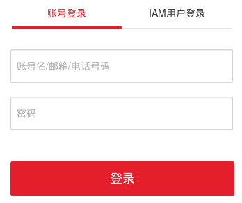
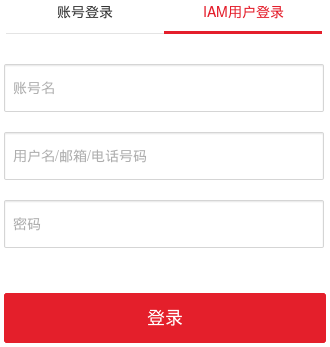

# fisclient #
[Switch to the English version](README.md)  
**fisclient** 是FIS（FPGA镜像服务）的命令行客户端，它将用于FPGA镜像管理的命令集成到一个shell中。

- [1 运行环境要求](#1-运行环境要求)
- [2 安装](#2-安装)
- [3 配置](#3-配置)
- [4 介绍](#4-介绍)
  - [4.1 命令](#41-命令)
  - [4.2 超时退出](#42-超时退出)
  - [4.3 日志记录](#43-日志记录)
- [5 使用场景](#5-使用场景)
  - [5.1 查询](#51-查询)
  - [5.2 删除](#52-删除)
  - [5.3 关联、解关联和查询关联](#53-关联解关联和查询关联)
- [6 fis命令详解](#6-fis命令详解)
  - [6.1 查看帮助信息](#61-查看帮助信息)
  - [6.2 删除子命令](#62-删除子命令)
  - [6.3 查询子命令](#63-查询子命令)
  - [6.4 关联子命令](#64-关联子命令)
  - [6.5 解关联子命令](#65-解关联子命令)
  - [6.6 查询关联子命令](#66-查询关联子命令)
- [7 区域特定参数](#7-区域特定参数)

# 1 运行环境要求 #
**fisclient** 是在以下环境中开发和测试的：

- CentOS 7.3
- Python 2.7

对于其他环境，不保证可用性。

# 2 安装 #
在安装之前，用户首先要确保已经以 **root** 身份登录弹性云服务器。

### 步骤1 绑定弹性IP ###
- 如何为弹性云服务器绑定弹性IP请参见[为弹性云服务器申请和绑定弹性IP](http://support.huaweicloud.com/usermanual-vpc/zh-cn_topic_0013748738.html)。

### 步骤2 下载源码包 ###
- 执行 **git clone https://github.com/Huawei/huaweicloud-fpga.git** 命令下载 **fisclient** 源码包（位于[FPGA开发套件](https://github.com/Huawei/huaweicloud-fpga)中）。

> 下载 **fisclient** 源码包时，请确保当前目录下没有以 **huaweicloud-fpga** 命名的文件或目录。 

### 步骤3 安装fisclient ###
- 执行 **cd huaweicloud-fpga/cli/fisclient** 命令切换到 **FPGA开发套件** 的 **huaweicloud-fpga/cli/fisclient** 目录。

- 执行 **bash install.sh** 命令安装fisclient工具。

> 安装过程中会安装 **fisclient** 工具的依赖包，请耐心等待。

# 3 配置 #
用户通过在Linux操作系统的shell中执行 **fisconfig** 命令进行 **fisclient** 工具的配置。在配置过程中，用户需要输入以下参数：

| 参数 | 说明 |
| ---- | ---- |
| **IAM Endpoint** | IAM服务的终端节点 |
| **FIS Endpoint** | FIS服务的终端节点 |
| **Project Name** | 项目名 |
| **Account User Name** | 账号用户名 |

### 步骤1 配置区域参数 ###
**IAM Endpoint**，**FIS Endpoint** 和 **Project Name** 参数与用户所在的区域相关，用户可以通过查询[区域特定参数](#region-specific-parameters)获取这些参数。 
例如在 **华北-北京一** 中，这三个参数应按如下配置：

| 参数 | 取值 |
| ---- | ---- |
| **IAM Endpoint** | iam.cn-north-1.myhuaweicloud.com |
| **FIS Endpoint** | ecs.cn-north-1.myhuaweicloud.com |
| **Project Name** | cn-north-1 |

### 步骤2 配置用户参数 ###
**Account User Name** 参数与用户在华为云上的登录方式相关。

- 账号登录

如果用户是以 **账号登录** 方式登录的，则将 **Account User Name** 参数配置为登录时使用的账号名。例如，若用户的账号名为 hwaccount，则 **Account User Name** 参数应配置为 **hwaccount**。

 

- IAM用户登录

如果用户是以 **IAM用户登录** 方式登录的，则将 **Account User Name** 参数配置为登录时使用的账号名和用户名，格式为“账号名,用户名”（使用英文逗号分隔）。例如，若用户的账号名为 hwaccount，用户名为 hwuser，则 **Account User Name** 参数应配置为 **hwaccount,hwuser**。

> 如果用户在登录华为云时没有使用账号名/用户名，可参考[如何查看安全凭证](https://support.huaweicloud.com/usermanual-iam/zh-cn_topic_0079477133.html)来查询自身的账号名和用户名。

### 步骤3 校验参数并保存 ###
在完成参数配置后，按照提示信息输入用户的华为云密码。如果参数校验通过，**fisclient** 工具会将这些配置保存到 **~/.fiscfg** 文件中。

# 4 介绍 #
在完成[配置fisclient工具](#configuration)后，用户通过在Linux操作系统的shell中执行 **fisclient** 命令进入fisclient登录界面，根据提示信息输入相应的 **华为云密码**，通过校验后进入fisclient命令行。在fisclient命令行中，用户可以执行相应的命令进行FPGA镜像的查询、删除、关联、解关联和查询关联等操作。
<pre>
[root@ ~]# fisclient
Please input the password of "hc***user": 
[fisclient] > 
</pre>

## 4.1 命令 ##
fisclient命令行支持两种命令：**fis** 和 **quit**。

**fis** 命令用于FPGA镜像的管理。例如，删除FPGA镜像的命令如下：
<pre>
[fisclient] > fis fpga-image-delete --fpga-image-id 000000005d19********30dc17ab02ab --force
Success: 204 No Content
</pre>
- **fpga-image-delete** 指定执行fis命令的删除子命令，即删除FPGA镜像。
- **--fpga-image-id** 和 **--force** 是删除子命令的命令选项。 **--fpga-image-id** 选项指定待删除的FPGA镜像的ID，例如 **000000005d19\*\*\*\*\*\*\*\*30dc17ab02ab**。 **--force** 选项指定执行强制删除操作，即删除前不需要用户确认。

fis命令的详细使用说明请参见[fis命令详解](#fis-command-description)。

**quit** 命令用于退出fisclient命令行。
<pre>
[fisclient] > quit 
[root@ ~]#
</pre>

## 4.2 超时退出 ##
在fisclient命令行中，如果用户在 **3600** 秒内没有执行任何命令，fisclient将自动超时退出。
<pre>
[fisclient] > 
time out, please press Enter to exit
[root@ ~]#
</pre>

## 4.3 日志记录 ##
fisclient会将用户对IAM和fis服务的访问记录保存在 **/var/log/fiscli/** 目录下的相应日志文件中。日志文件按照日期命名，例如 **2017_09_01.log** 文件中记录的是用户在2017年9月1日的访问记录。
 
日志信息按照 **时间 用户 操作 [参数] 结果** 的格式进行记录。例如：
<pre>
[2017-09-01-08-58-48] user [hc***user cn-north-1] get_token Success, Created. (HTTP 201)
</pre>
上述信息表示在2017年9月1日8时58分48秒，用户hc\*\*\*user在cn-north-1区域身份校验通过，成功访问IAM服务获取token。
<pre>
[2017-09-01-15-34-40] user [hc***user cn-north-1] do_fpga_image_list {"page": "1", "size": "8"}, Success, 200 OK
</pre>
上述信息表示在2017年9月1日15时34分40秒，用户hc\*\*\*user在cn-north-1区域执行FPGA镜像查询操作，**page** 参数为1，**size** 为8，成功访问fis服务查询FPGA镜像信息。

# 5 使用场景 #
## 5.1 查询 ##
在注册FPGA镜像后，用户可以使用fis查询子命令查询自身拥有的FPGA镜像的信息。在确认FPGA镜像的状态是 **active** 后，用户可以使用相应的FPGA镜像ID执行后续的加载、删除、关联等操作。 

> 注意，用户通过fis查询子命令只能查询到**自身拥有的FPGA镜像**的信息。对于购买的和共享的FPGA镜像，用户需要通过**fis查询关联子命令**来查询相应的信息。例如，用户可以参考[查询共享的FPGA镜像](#querying-the-shared-fpga-image)来了解如何查询FPGA共享镜像的信息。

fis查询子命令以一个表格来呈现FPGA镜像信息，并且支持分页查询功能。更多详细信息请参见[查询子命令](#query-subcommand)。

### 示例 ###
执行以下fis命令查询FPGA镜像：
<pre>
[fisclient] > fis fpga-image-list
Success: 200 OK
+----------------------------------+---------+--------+-----------+------+---------------------+-------------+---------------------------------------------------------------------------------------------------------------------------------------------------------------------------------------------------------------------------------------------------------------+---------+
| id                               | name    | status | protected | size | createdAt           | description | metadata                                                                                                                                                                                                                                                      | message |
+----------------------------------+---------+--------+-----------+------+---------------------+-------------+---------------------------------------------------------------------------------------------------------------------------------------------------------------------------------------------------------------------------------------------------------------+---------+
| 000000******08b4015e3224afe203c3 | OCL_001 | active | False     | 43   | 2017-09-19 02:27:31 | mmult_01    | {"manifest_format_version": "1", "pci_vendor_id": "0x19e5", "pci_device_id": "0xD512", "pci_subsystem_id": "-", "pci_subsystem_vendor_id": "-", "shell_type": "0x121", "shell_version": "0x0001", "hdk_version": "SDx 2017.1", "date": "2017/09/17_18:37:12"} |         |
+----------------------------------+---------+--------+-----------+------+---------------------+-------------+---------------------------------------------------------------------------------------------------------------------------------------------------------------------------------------------------------------------------------------------------------------+---------+
</pre>
- 用户之前注册的FPGA镜像的ID为 **000000\*\*\*\*\*\*08b4015e3224afe203c3**。
- FPGA镜像的状态为 **active**，表示用户之前的注册操作执行成功。

因此，用户可以使用该FPGA镜像ID进行后续的加载、删除、关联等操作。

## 5.2 删除 ##
删除操作允许FPGA镜像的拥有者执行FPGA镜像的删除操作。当用户不再使用某个注册成功的FPGA镜像，并且希望从FPGA镜像管理模块中删除该FPGA镜像相关的记录时，可以使用fis删除子命令进行FPGA镜像删除操作。此外，如果用户在执行fis查询子命令时发现某个FPGA镜像的状态是 **error** 时，可以使用fis删除子命令删除该FPGA镜像记录。 
如果FPGA镜像已经和某个弹性云服务器镜像关联，FPGA镜像将被置于“保护”状态（FPGA镜像的 **protected** 属性被置为 **True**），不允许被删除。更多详细信息请参见[删除子命令](#deletion-subcommand)。

### 删除确认 ###
默认情况下，fisclient为用户提供删除确认功能，在用户执行删除操作时会提示用户输入 **yes** 或 **no** 以确认是否进行删除操作。

- 如果用户输入 **yes**，则执行当前的删除操作。
- 如果用户输入 **no**，则取消当前的删除操作。

<pre>
[fisclient] > fis fpga-image-delete --fpga-image-id 4010b39d********015d5ee5c3b00501
Deleted fpga-image cannot be restored! Are you absolutely sure? (yes/no): no
cancel fpga-image-delete
[fisclient] > fis fpga-image-delete --fpga-image-id 4010b39d********015d5ee5c3b00501
Deleted fpga-image cannot be restored! Are you absolutely sure? (yes/no): yes
Success: 204 No Content
</pre>
如果用户不想在每次执行fis删除子命令时都进行用户确认操作，则可以指定 **--force** 选项，强制执行删除操作。

### 示例 ###
用户在某次执行查询操作时返回的FPGA镜像信息如下所示：
<pre>
+----------------------------------+----------+--------+-----------+------+---------------------+-------------+-------------------------------------------------------------------------------------------------------------------------------------------------------------------------------------------------------------------------------------------------------------------------------------------------------------------------------------------------------------------------------------------+----------------------------+
| id                               | name     | status | protected | size | createdAt           | description | metadata                                                                                                                                                                                                                                                                                                                                                                                  | message                    |
+----------------------------------+----------+--------+-----------+------+---------------------+-------------+-------------------------------------------------------------------------------------------------------------------------------------------------------------------------------------------------------------------------------------------------------------------------------------------------------------------------------------------------------------------------------------------+----------------------------+
| ff********5056b2015d5e13608c73c7 | OCL_001  | active | False     | 43   | 2017-09-19 02:27:31 | mmult_01    | {"manifest_format_version": "1", "pci_vendor_id": "0x19e5", "pci_device_id": "0xD512", "pci_subsystem_id": "-", "pci_subsystem_vendor_id": "-", "shell_type": "0x121", "shell_version": "0x0001", "hdk_version": "SDx 2017.1", "date": "2017/09/18_18:27:12"}                                                                                                                             |                            |
| 4010b39c5d4********48e97411005ae | dpdk_002 | error  | False     | 45   | 2017-09-19 16:39:27 | example_02  | {"manifest_format_version": "1", "pci_vendor_id": "0x19e5", "pci_device_id": "0xD503", "pci_subsystem_id": "-", "pci_subsystem_vendor_id": "-", "dcp_hash": "ced75657********60f212a9454f6c5ae33d50f0a248e99dbef638231b26960c", "shell_type": "0x101", "shell_version": "0x0013", "dcp_file_name": "ul_pr_top_routed.dcp", "hdk_version": "Vivado 2017.2", "date": "2017/09/19_13:51:41"} | register fpga image failed |
+----------------------------------+----------+--------+-----------+------+---------------------+-------------+-------------------------------------------------------------------------------------------------------------------------------------------------------------------------------------------------------------------------------------------------------------------------------------------------------------------------------------------------------------------------------------------+----------------------------+
</pre>
如果用户希望删除不再使用的ID为 **ff\*\*\*\*\*\*\*\*5056b2015d5e13608c73c7** 的FPGA镜像，以及注册失败的ID为 **4010b39c5d4\*\*\*\*\*\*\*\*48e97411005ae** 的FPGA镜像，可以执行如下的fis命令：

- 删除不再使用的FPGA镜像。
<pre>
[fisclient] > fis fpga-image-delete --fpga-image-id ff********5056b2015d5e13608c73c7 --force
Success: 204 No Content
</pre>

- 删除状态为error的FPGA镜像。
<pre>
[fisclient] > fis fpga-image-delete --fpga-image-id 4010b39c5d4********48e97411005ae --force
Success: 204 No Content
</pre>

在上述命令中，**--fpga-image-id** 选项指定待删除的FPGA镜像的ID，**--force** 选项指定执行强制删除操作。如果命令的回显信息为 **Success: 204 No Content**，则表示fis删除子命令执行成功。然而，删除子命令执行成功并不代表FPGA镜像删除成功。用户需要执行查询操作，如果查找不到待删除的FPGA镜像的信息，则表示FPGA镜像删除成功。

## 5.3 关联、解关联和查询关联 ##
通过关联操作，用户可以将已成功注册的FPGA镜像提供给其他用户使用，包括如下两种场景：

- 市场镜像场景：将已成功注册的FPGA镜像发布到云市场进行交易。
- 共享镜像场景：将已成功注册的FPGA镜像共享给指定用户。

通过查询关联操作，用户可以查询其他用户提供的FPGA镜像。通过解关联操作，用户可以取消FPGA镜像的共享。 
本小节以共享镜像场景为例来说明关联、解关联和查询关联操作的使用。这些子命令的更多详细信息请参见[关联子命令](#association-subcommand)、[解关联子命令](#disassociation-subcommand)和[查询关联子命令](#association-query-subcommand)。

### 共享FPGA镜像 ###
当用户A想要将自己拥有的一个已注册成功的FPGA镜像共享给用户B时，需要完成以下步骤。以下假设用户A想将ID为 **4010b39c5d4\*\*\*\*\*\*\*\*\*\*f2cf8070c7e** 的 **通用型架构** 的FPGA镜像共享给用户B。 

- 步骤1：从 **通用型架构** 的FPGA弹性云服务器创建一个ECS私有镜像，更多详细信息请参见[创建私有镜像](http://support.huaweicloud.com/usermanual-ims/zh-cn_topic_0030713180.html)。
- 步骤2：在创建的ECS私有镜像的详情页面中获取镜像ID。以下假设创建的ECS私有镜像的镜像ID为 **404223ca-8\*\*b-4\*\*2-a\*\*e-d187\*\*\*\*61bc**。
- 步骤3：关联待共享的FPGA镜像和创建的ECS私有镜像。

用户A需要登录到FPGA弹性云服务器中，运行 **fisclient** 程序，然后执行fis关联子命令来关联FPGA镜像和ECS私有镜像。
<pre>
[fisclient] > fis fpga-image-relation-create --fpga-image-id 4010b39c5d4**********f2cf8070c7e --image-id 404223ca-8**b-4**2-a**e-d187****61bc
Success: 204 No Content
</pre>
如果命令的回显信息为 **Success: 204 No Content**，则表示关联操作执行成功。

- 步骤4：将创建的ECS私有镜像共享给用户B，更多细节信息请参见[共享私有镜像](http://support.huaweicloud.com/usermanual-ims/zh-cn_topic_0032042419.html)。

> ECS私有镜像在共享之后会变为 **共享镜像**，无法进行关联操作。因此，确保在共享镜像之前进行关联。

### 查询共享的FPGA镜像 ###
当用户B想要使用用户A共享的FPGA镜像时，需要完成以下步骤。

- 步骤1：接受用户A共享的ECS镜像，更多详细信息请参见[接受共享镜像](http://support.huaweicloud.com/usermanual-ims/zh-cn_topic_0032042420.html)。
- 步骤2：从用户A处获取共享的FPGA镜像的类型。在本示例中，FPGA镜像的类型是 **通用型架构**。
- 步骤3：使用共享的ECS镜像创建一个与共享的FPGA镜像相同类型的FPGA弹性云服务器，更多详细信息请参见[购买并登录Linux弹性云服务器](https://support.huaweicloud.com/qs-ecs/zh-cn_topic_0092494193.html)。在本示例中，用户B需要创建一个 **通用型架构** 的FPGA弹性云服务器。
> 确保创建的FPGA弹性云服务器的类型与共享的FPGA镜像的类型相同。

- 步骤4：在共享的ECS镜像的详情页面中获取镜像ID。在本示例中，共享的ECS镜像的镜像ID是 **404223ca-8\*\*b-4\*\*2-a\*\*e-d187\*\*\*\*61bc**。
- 步骤5：使用共享的ECS镜像的镜像ID作为参数来查询用户A共享的FPGA镜像。

用户B需要登录到使用用户A共享的ECS镜像创建的FPGA弹性云服务器中，运行 **fisclient** 程序，然后执行fis查询关联子命令（将 **image-id** 参数设置为共享的ECS镜像的镜像ID）来查询用户A共享的FPGA镜像。
<pre>
[fisclient] > fis fpga-image-relation-list --image-id 404223ca-8**b-4**2-a**e-d187****61bc
Success: 200 OK
+--------------------------------------+----------------------------------+---------+--------+-----------+------+---------------------+-------------+----------------------------------------------------------------------------------------------------------------------------------------------------------------------------------------------------------------------------------------------------------------+---------+
| image_id                             | fpga_image_id                    | name    | status | protected | size | createdAt           | description | metadata                                                                                                                                                                                                                                                       | message |
+--------------------------------------+----------------------------------+---------+--------+-----------+------+---------------------+-------------+----------------------------------------------------------------------------------------------------------------------------------------------------------------------------------------------------------------------------------------------------------------+---------+
| 404223ca-8**b-4**2-a**e-d187****61bc | 4010b39c5d4**********f2cf8070c7e | name123 | active | True      | 39   | 2017-09-19 03:27:31 | desc123     |  {"manifest_format_version": "1", "pci_vendor_id": "0x19e5", "pci_device_id": "0xD512", "pci_subsystem_id": "-", "pci_subsystem_vendor_id": "-", "shell_type": "0x121", "shell_version": "0x0001", "hdk_version": "SDx 2017.1", "date": "2017/09/18_19:27:12"} |         |
+--------------------------------------+----------------------------------+---------+--------+-----------+------+---------------------+-------------+----------------------------------------------------------------------------------------------------------------------------------------------------------------------------------------------------------------------------------------------------------------+---------+
</pre>
上述回显信息表示用户A共享的FPGA镜像的ID是 **4010b39c5d4\*\*\*\*\*\*\*\*\*\*f2cf8070c7e**。用户B可以使用该FPGA镜像ID进行后续的加载操作。

### 取消FPGA镜像共享 ###
当用户A想取消给用户B的FPGA镜像共享时，需要完成以下步骤。

- 步骤1：取消给用户B的ECS镜像共享，更多详细信息请参见[取消共享镜像的共享](http://support.huaweicloud.com/usermanual-ims/zh-cn_topic_0032087324.html)。
- 步骤2：解关联共享的FPGA镜像和ECS镜像。

用户A需要登录到FPGA弹性云服务器中，运行 **fisclient** 程序，然后执行fis解关联子命令来解关联FPGA镜像和ECS镜像。
<pre>
[fisclient] > fis fpga-image-relation-delete --fpga-image-id 4010b39c5d4**********f2cf8070c7e --image-id 404223ca-8**b-4**2-a**e-d187****61bc
Success: 204 No Content
</pre>
如果命令的回显信息为 **Success: 204 No Content**，则表示解关联操作执行成功。

# 6 fis命令详解 #
## 6.1 查看帮助信息 ##
在fisclient命令行中，执行 **fis help** 命令查看fis命令的帮助信息，执行 **fis help subcommand** 命令查看fis子命令的帮助信息。
<pre>
[fisclient] > fis help 
usage: fis &lt;subcommand&gt; ...

Command-line interface to the fis API. 

positional arguments: 
  &lt;subcommand&gt; 
    fpga-image-delete   Delete an FPGA image
    fpga-image-list     Query FPGA images of a tenant
    fpga-image-relation-create
                        Create the relation of an FPGA image and an ECS image
    fpga-image-relation-delete
                        Delete the relation of an FPGA image and an ECS image
    fpga-image-relation-list
                        Query FPGA image relations visible to a tenant
    help                Display help about fis or one of its subcommands

See "fis help COMMAND" for help on a specific command.
</pre>

fis命令的格式为 **fis subcommand option**

- 子命令 **subcommand** 指定执行的fis命令的功能。
- 选项 **option** 特定于子命令，为子命令指定命令参数。

fis命令包含如下6个子命令。

| 命令 | 说明 |
| ------- | ----------- |
| **fpga-image-delete** | 删除子命令，用于删除FPGA镜像 |
| **fpga-image-list** | 查询子命令，用于查询租户拥有的FPGA镜像详情列表信息 |
| **fpga-image-relation-create** | 关联子命令，用于创建FPGA镜像与弹性云服务器镜像的关联关系 |
| **fpga-image-relation-delete** | 解关联子命令，用于删除FPGA镜像与弹性云服务器镜像的关联关系 |
| **fpga-image-relation-list** | 查询关联子命令，用于查询租户可见的FPGA镜像与弹性云服务器镜像的关联关系 |
| **help** | 帮助子命令，用于显示fis命令或fis子命令的帮助信息 |

> fis命令还包含一个注册子命令 **fpga-image-register**，在Linux操作系统的shell中调用，用于注册FPGA镜像。该子命令在用户执行 **AEI_Register.sh** 脚本时将自动调用。用户不需要单独执行该命令实现注册FPGA镜像。

## 6.2 删除子命令 ##
删除子命令为用户提供删除FPGA镜像管理模块中的相应FPGA镜像的功能。在成功执行删除操作后，针对被删除的FPGA镜像的加载、关联、删除等操作都将失败。

### 命令格式 ###
**fis fpga-image-delete --fpga-image-id** *&lt;UUID&gt;* **[--force]**

### 参数说明 ###
| 参数 | 说明 | 取值 | 备注 |
| --------- | ----------- | ----- | ------- |
| **--fpga-image-id** | （必选）待删除的FPGA镜像的ID。 | **fpga-image-id**参数是由英文小写字母a-f，数字0-9组成的32位字符串。 | 在查询子命令执行成功后，用户可以在回显信息中查找到相应的FPGA镜像ID。 |
| **--force** | （可选）一个命令选项，不带参数，用于取消删除确认功能。 | - | 在默认情况下，fisclient为用户提供删除确认功能，在用户执行删除操作时会提示用户输入 **yes** 或 **no** 以确认是否进行删除操作：输入 **yes** 则执行当前的删除操作；输入 **no** 则取消当前的删除操作。 |

> **--force** 选项只是取消了删除确认功能，并不保证一定能够成功删除FPGA镜像。

### 使用说明 ###
当回显信息中包含 **Success: 204 No Content** 时，表示删除子命令执行成功。
<pre>
Success: 204 No Content
</pre>
删除子命令执行成功并不代表FPGA镜像删除成功。用户需要进一步执行查询子命令，若查找不到待删除的FPGA镜像的信息，则表示FPGA镜像删除成功。
  
当删除子命令执行失败时，回显信息中会包含相应的错误原因信息。

- Example 1
<pre>
[fisclient] > fis fpga-image-delete --fpga-image-id 123456 --force 
Error: parameter fpga_image_id (123456) is malformed
</pre>
错误信息表示 **fpga-image-id** 参数不符合相应的限制条件，不是由英文小写字母a-f和数字0-9组成的32位字符串。

- Example 2
<pre>
[fisclient] > fis fpga-image-delete --fpga-image-id 000000005d44********44df075a003c --force   
Error: 400 Bad Request
tenant [495440c1********8e9403e708ad4d9d] fpga image [000000005d44********44df075a003c] is protected 
</pre>
错误信息表示FPGA镜像已经和某个弹性云服务器镜像关联，处于“保护”状态，无法被删除。

### 示例 ###
从FPGA镜像管理模块中删除ID为 **000000005d19076b015d30dc17ab02ab** 的FPGA镜像。
<pre>
[fisclient] > fis fpga-image-delete --fpga-image-id 000000005d19********30dc17ab02ab 
Deleted fpga-image cannot be restored! Are you absolutely sure? (yes/no): no 
cancel fpga-image-delete 
[fisclient] > fis fpga-image-delete --fpga-image-id 000000005d19********30dc17ab02ab --force 
Success: 204 No Content
</pre>

## 6.3 查询子命令 ##
查询子命令以表格的形式呈现租户拥有的FPGA镜像的信息。同时，查询子命令提供分页查询功能。

### 命令格式 ###
**fis fpga-image-list** **[--page** *&lt;Int&gt;***] [--size** *&lt;Int&gt;***]**

### 参数说明 ###
| 参数 | 说明 | 取值 | 备注 |
| --------- | ----------- | ----- | ------- |
| **--page** | （可选）分页查询时的页编号。 | **page**参数是[1,65535)范围内的十进制整数，并且不能包含+号。 | 由用户自行指定。 |
| **--size** | （可选）分页查询时的页大小。 | **size**参数是[1,100]范围内的十进制整数，并且不能包含+号。 | 由用户自行指定。 |

> **page** 参数和 **size** 参数必须同时存在或同时不存在，并且只有当两个参数同时存在时分页查询功能才能生效。

### 使用说明 ###
当回显信息中包含 **Success: 200 OK** 时，表示查询子命令执行成功，此时回显信息是一个包含下述列标题的表格。
<pre>
+----+------+--------+-----------+------+-----------+-------------+----------+---------+
| id | name | status | protected | size | createdAt | description | metadata | message |
+----+------+--------+-----------+------+-----------+-------------+----------+---------+
</pre>
The following table describes the table headers.

| 参数 | 说明 |
| --------- | ----------- |
| **id** | FPGA镜像的ID |
| **name** | FPGA镜像的名称 |
| **status** | FPGA镜像的状态 |
| **protected** | FPGA镜像是否处于“保护”状态 |
| **size** | FPGA镜像的文件大小，单位为MB |
| **createdAt** | FPGA镜像的创建时间（UTC） |
| **description** | FPGA镜像的描述信息 |
| **metadata** | FPGA镜像的元数据信息 |
| **message** | FPGA镜像的附加消息 |

 
当查询子命令执行失败时，回显信息中会包含相应的错误原因信息。

- Example 1
<pre>
[fisclient] > fis fpga-image-list --page 1
Error: argument --page and --size must exist or not exist at the same time
</pre>
错误信息表示用户只设置了 **page** 参数，而没有设置 **size** 参数。

- Example 2
<pre>
[fisclient] > fis fpga-image-list --page 1 --size 101
Error: parameter size (101) is malformed
</pre>
错误信息表示 **size** 参数不符合相应的限制条件，不是位于[1,100]范围内的十进制整数。

### 示例 ###
使用分页功能（页编号为1，页大小为2）查询租户拥有的FPGA镜像信息。
<pre>
[fisclient] > fis fpga-image-list --page 1 --size 2
Success: 200 OK
+----------------------------------+----------+--------+-----------+------+---------------------+-------------+-------------------------------------------------------------------------------------------------------------------------------------------------------------------------------------------------------------------------------------------------------------------------------------------------------------------------------------------------------------------------------------------+---------+
| id                               | name     | status | protected | size | createdAt           | description | metadata                                                                                                                                                                                                                                                                                                                                                                                  | message |
+----------------------------------+----------+--------+-----------+------+---------------------+-------------+-------------------------------------------------------------------------------------------------------------------------------------------------------------------------------------------------------------------------------------------------------------------------------------------------------------------------------------------------------------------------------------------+---------+
| 00000000********015e98dce81501db | dpdk_001 | active | False     | 45   | 2017-09-18 16:29:27 | example_01  | {"manifest_format_version": "1", "pci_vendor_id": "0x19e5", "pci_device_id": "0xD503", "pci_subsystem_id": "-", "pci_subsystem_vendor_id": "-", "dcp_hash": "ced75657********60f212a9454f6c5ae33d50f0a248e99dbef638231b26960c", "shell_type": "0x101", "shell_version": "0x0013", "dcp_file_name": "ul_pr_top_routed.dcp", "hdk_version": "Vivado 2017.2", "date": "2017/09/18_13:41:41"} |         |
| 00000000********015e97f6408d01cd | OCL_001  | active | False     | 43   | 2017-09-18 02:37:31 | mmult_01    | {"manifest_format_version": "1", "pci_vendor_id": "0x19e5", "pci_device_id": "0xD512", "pci_subsystem_id": "-", "pci_subsystem_vendor_id": "-", "shell_type": "0x121", "shell_version": "0x0001", "hdk_version": "SDx 2017.1", "date": "2017/09/17_18:37:12"}                                                                                                                             |         |
+----------------------------------+----------+--------+-----------+------+---------------------+-------------+-------------------------------------------------------------------------------------------------------------------------------------------------------------------------------------------------------------------------------------------------------------------------------------------------------------------------------------------------------------------------------------------+---------+
</pre>

## 6.4 关联子命令 ##
关联子命令为用户提供关联FPGA镜像与弹性云服务器镜像的功能。在建立关联关系后，FPGA镜像会被置于“保护”状态，无法被删除。

### 命令格式 ###
**fis fpga-image-relation-create --fpga-image-id** *&lt;UUID&gt;* **--image-id** *&lt;UUID&gt;*
 
### 参数说明 ###
| 参数 | 说明 | 取值 | 备注 |
| --------- | ----------- | ----- | ------- |
| **--fpga-image-id** | （必选）待关联的FPGA镜像的ID。 | **fpga-image-id**参数是由英文小写字母a-f，数字0-9组成的32位字符串。 | 在查询子命令执行成功后，用户可以在回显信息中查找到相应的FPGA镜像ID。 |
| **--image-id** | （必选）待关联的弹性云服务器镜像的ID。 | **image-id**参数遵循IMS（镜像服务）的镜像ID限制。 | 用户可以在镜像的详情页面中获取镜像ID。 |

> FPGA镜像管理模块在进行关联操作时，要求弹性云服务器镜像的类型是 **private**，即私有镜像。而私有镜像在发布到云市场或进行共享操作后，镜像类型会分别变为 **market** 和 **shared**，从而无法进行关联操作。用户需要将已发布到云市场的镜像下架，或将已共享的镜像取消共享，才能进行关联操作。

### 使用说明 ###
当回显信息中包含 **Success: 204 No Content** 时，表示关联子命令执行成功。
<pre>
Success: 204 No Content
</pre>

当关联子命令执行失败时，回显信息中会包含相应的错误原因信息。

- Example 1
<pre>
[fisclient] > fis fpga-image-relation-create --fpga-image-id 000000005d44********53b720a40210 --image-id 5633dfaf-7**e-4**4-9**8-6202****6f7b
Error: 400 Bad Request
tenant [495440c1********8e9403e708ad4d9d] image [5633dfaf-7**e-4**4-9**8-6202****6f7b] type [shared] is not private
</pre>
错误信息表示用户指定的弹性云服务器镜像的类型是 **shared**，不是要求的 **private**，从而无法执行关联操作。

- Example 2
<pre>
[fisclient] > fis fpga-image-relation-create --fpga-image-id 4010a32c5f5b********5bd53ab4004b --image-id 5633dfaf-7**e-4**4-9**8-6202****6f7b
Error: 400 Bad Request
tenant [495440c1********8e9403e708ad4d9d] relate fpga image [4010a32c5f5b********5bd53ab4004b] and image [5633dfaf-7**e-4**4-9**8-6202****6f7b] failed: relation already exist or the related fpga image count of image reach the max limit 
</pre>
错误信息表示用户待创建的关联关系违反了FPGA镜像管理模块对关联关系的约束，从而无法执行关联操作。
 
FPGA镜像管理模块对待创建的关联关系有如下的**约束**：

 - FPGA镜像和弹性云服务器镜像之间 **不能** 重复创建关联关系。
 - 一个弹性云服务器镜像最多只允许关联 **10** 个FPGA镜像。

### 示例 ###
创建ID为 **000000005d19\*\*\*\*\*\*\*\*30dec20e02b3** 的FPGA镜像与ID为 **b79bbfe9-9\*\*a-4\*\*b-8\*\*f-9d61\*\*\*\*efa0** 的弹性云服务器镜像之间的关联关系。
<pre>
[fisclient] > fis fpga-image-relation-create --fpga-image-id 000000005d19********30dec20e02b3 --image-id b79bbfe9-9**a-4**b-8**f-9d61****efa0
Success: 204 No Content
</pre>

## 6.5 解关联子命令 ##
解关联子命令为用户提供删除FPGA镜像与弹性云服务器镜像之间的关联关系的功能。在删除关联关系后，如果FPGA镜像没有再与其他的弹性云服务器镜像关联，则不再处于“保护”状态，允许进行删除操作。

### 命令格式 ###
**fis fpga-image-relation-delete --fpga-image-id** *&lt;UUID&gt;* **--image-id** *&lt;UUID&gt;*

### 参数说明 ###
| 参数 | 说明 | 取值 | 备注 |
| --------- | ----------- | ----- | ------- |
| **--fpga-image-id** | （必选）待解关联的FPGA镜像的ID。 | **fpga-image-id**参数是由英文小写字母a-f，数字0-9组成的32位字符串。 | 在查询关联子命令执行成功后，用户可以在回显信息中查找到相应的FPGA镜像ID。 |
| **--image-id** | （必选）待解关联的弹性云服务器镜像的ID。 | **image-id**参数遵循IMS（镜像服务）的镜像ID限制。 | 在查询关联子命令执行成功后，用户可以在回显信息中查找到相应的镜像ID。 |

> FPGA镜像管理模块在进行解关联操作时，要求弹性云服务器镜像的类型是 **private**，即私有镜像。而私有镜像在发布到云市场或进行共享操作后，镜像类型会分别变为 **market** 和 **shared**，从而无法进行解关联操作。用户需要将已发布到云市场的镜像下架，或将已共享的镜像取消共享，才能进行解关联操作。

### 使用说明 ###
当回显信息中包含 **204 No Content** 时，表示解关联子命令执行成功。
<pre>
Success: 204 No Content
</pre>

当解关联子命令执行失败时，回显信息中会包含相应的错误原因信息。

- Example 1
<pre>
[fisclient] > fis fpga-image-relation-delete --fpga-image-id 4010a32b5f57********5ce866fc0004 --image-id ae606e5b-1**b-4**1-b**a-d37d****26dd
Error: 400 Bad Request 
tenant [495440c1********8e9403e708ad4d9d] is not the owner of fpga image [4010a32b5f57********5ce866fc0004]
</pre>
错误信息表示用户不是待解关联的FPGA镜像的拥有者，无权执行解关联操作。

- Example 2
<pre>
[fisclient] > fis fpga-image-relation-delete --fpga-image-id 4010a32b5f52********53b0104d0176 --image-id 5633dfaf-7**e-4**4-9fa8-6202****6f7b
Error: 400 Bad Request
tenant [495440c1********8e9403e708ad4d9d] image [5633dfaf-7**e-4**4-9fa8-6202****6f7b] type [shared] is not private
</pre>
错误信息表示用户指定的弹性云服务器镜像的类型是 **shared**，不是要求的 **private**，从而无法执行解关联操作。

### 示例 ###
删除ID为 **000000005d19\*\*\*\*\*\*\*\*30dec20e02b3** 的FPGA镜像与ID为 **b79bbfe9-9\*\*a-4\*\*b-8\*\*f-9d61\*\*\*\*efa0** 的弹性云服务器镜像之间的关联关系。
<pre>
[fisclient] > fis fpga-image-relation-delete --fpga-image-id 000000005d19********30dec20e02b3 --image-id b79bbfe9-9**a-4**b-8**f-9d61****efa0
Success: 204 No Content
</pre>

## 6.6 查询关联子命令 ##
查询关联子命令以表格的形式呈现租户可见的FPGA镜像与弹性云服务器镜像的关联关系信息。同时，查询关联子命令提供分页查询功能。

### 命令格式 ###
**fis fpga-image-relation-list [--fpga-image-id** *&lt;UUID&gt;***]** **[--image-id** *&lt;UUID&gt;***]** **[--page** *&lt;Int&gt;***] [--size** *&lt;Int&gt;***]**

### 参数说明 ###
| 参数 | 说明 | 取值 | 备注 |
| --------- | ----------- | ----- | ------- |
| **--fpga-image-id** | （可选）待查询关联的FPGA镜像的ID。 | **fpga-image-id**参数是由英文小写字母a-f，数字0-9组成的32位字符串。 | 在查询子命令执行成功后，用户可以在回显信息中查找到相应的FPGA镜像ID。 |
| **--image-id** | （可选）待查询关联的弹性云服务器镜像的ID。 | **image-id**参数遵循IMS（镜像服务）的镜像ID限制。 | 用户可以在镜像的详情页面中获取镜像ID。 |
| **--page** | （可选）分页查询时的页编号。 | **page**参数是[1,65535)范围内的十进制整数，并且不能包含+号。 | 由用户自行指定。 |
| **--size** | （可选）分页查询时的页大小。 | **size**参数是[1,100]范围内的十进制整数，并且不能包含+号。 | 由用户自行指定。 |

> **page** 参数和 **size** 参数必须同时存在或同时不存在，并且只有当两个参数同时存在时分页查询功能才能生效。 当同时指定 **fpga_image_id** 参数和 **image_id** 参数时，分页查询参数 **page** 和 **size** 将不起作用。

### 使用说明 ###
当回显信息中包含 **Success: 200 OK** 时，表示查询关联子命令执行成功。此时，回显信息是一个包含下述列标题的表格，表格的每一行表示一条关联关系。
<pre>
+----------+---------------+------+--------+-----------+------+-----------+-------------+----------+---------+
| image_id | fpga_image_id | name | status | protected | size | createdAt | description | metadata | message |
+----------+---------------+------+--------+-----------+------+-----------+-------------+----------+---------+
</pre>
列标题的含义如下表所示。

| 参数 | 说明 |
| --------- | ----------- |
| **image_id** | 弹性云服务器镜像的ID |
| **fpga_image_id** | FPGA镜像的ID |
| **name** | FPGA镜像的名称 |
| **status** | FPGA镜像的状态 |
| **protected** | FPGA镜像是否处于“保护”状态 |
| **size** | FPGA镜像的文件大小，单位为MB |
| **createdAt** | FPGA镜像的创建时间（UTC） |
| **description** | FPGA镜像的描述信息 |
| **metadata** | FPGA镜像的元数据信息 |
| **message** | FPGA镜像的附加消息 |

 
当查询子命令执行失败时，回显信息中会包含相应的错误原因信息。

- Example 1
<pre>
[fisclient] > fis fpga-image-relation-list --page 1
Error: argument --page and --size must exist or not exist at the same time
</pre>
错误信息表示用户只设置了 **page** 参数，而没有设置 **size** 参数。

- Example 2
<pre>
[fisclient] > fis fpga-image-relation-list --fpga-image-id 4010a3ac5c5b********5b3524850023
Error: 404 Not Found
tenant [495440c1********8e9403e708ad4d9d] fpga image [4010a3ac5c5b********5b3524850023] doesn't exist
</pre>
错误信息表示用户指定的FPGA镜像不存在于FPGA镜像管理模块中，无法查询相应的关联关系。

### 示例 ###
使用分页功能（页编号为1，页大小为2），指定弹性云服务器镜像ID为 **404223ca-8\*\*b-4\*\*2-a\*\*e-d187\*\*\*\*61bc** 查询租户可见的关联关系信息。
<pre>
[fisclient] > fis fpga-image-relation-list --image-id 404223ca-8**b-4**2-a**e-d187****61bc --page 1 --size 2
Success: 200 OK
+--------------------------------------+----------------------------------+----------+--------+-----------+------+---------------------+-------------+-------------------------------------------------------------------------------------------------------------------------------------------------------------------------------------------------------------------------------------------------------------------------------------------------------------------------------------------------------------------------------------------+---------+
| image_id                             | fpga_image_id                    | name     | status | protected | size | createdAt           | description | metadata                                                                                                                                                                                                                                                                                                                                                                                  | message |
+--------------------------------------+----------------------------------+----------+--------+-----------+------+---------------------+-------------+-------------------------------------------------------------------------------------------------------------------------------------------------------------------------------------------------------------------------------------------------------------------------------------------------------------------------------------------------------------------------------------------+---------+
| 404223ca-8**b-4**2-a**e-d187****61bc | 00000000********015e98dce81501db | dpdk_001 | active | True      | 45   | 2017-09-18 16:29:27 | example_01  | {"manifest_format_version": "1", "pci_vendor_id": "0x19e5", "pci_device_id": "0xD503", "pci_subsystem_id": "-", "pci_subsystem_vendor_id": "-", "dcp_hash": "ced75657********60f212a9454f6c5ae33d50f0a248e99dbef638231b26960c", "shell_type": "0x101", "shell_version": "0x0013", "dcp_file_name": "ul_pr_top_routed.dcp", "hdk_version": "Vivado 2017.2", "date": "2017/09/18_13:41:41"} |         |
| 404223ca-8**b-4**2-a**e-d187****61bc | 00000000********015e97f6408d01cd | OCL_001  | active | True      | 43   | 2017-09-18 02:37:31 | mmult_01    | {"manifest_format_version": "1", "pci_vendor_id": "0x19e5", "pci_device_id": "0xD512", "pci_subsystem_id": "-", "pci_subsystem_vendor_id": "-", "shell_type": "0x121", "shell_version": "0x0001", "hdk_version": "SDx 2017.1", "date": "2017/09/17_18:37:12"}                                                                                                                             |         |
+--------------------------------------+----------------------------------+----------+--------+-----------+------+---------------------+-------------+-------------------------------------------------------------------------------------------------------------------------------------------------------------------------------------------------------------------------------------------------------------------------------------------------------------------------------------------------------------------------------------------+---------+
</pre>

# 7 区域特定参数 #

| **华北-北京一** ||
| ------- | ----------- |
| **IAM Endpoint** | iam.cn-north-1.myhuaweicloud.com |
| **FIS Endpoint** | ecs.cn-north-1.myhuaweicloud.com |
| **Project Name** | cn-north-1 |

 

| **华南-广州** ||
| ------- | ----------- |
| **IAM Endpoint** | iam.cn-south-1.myhuaweicloud.com |
| **FIS Endpoint** | ecs.cn-south-1.myhuaweicloud.com |
| **Project Name** | cn-south-1 |

 

| **华东-上海二** ||
| ------- | ----------- |
| **IAM Endpoint** | iam.cn-east-2.myhuaweicloud.com |
| **FIS Endpoint** | ecs.cn-east-2.myhuaweicloud.com |
| **Project Name** | cn-east-2 |
