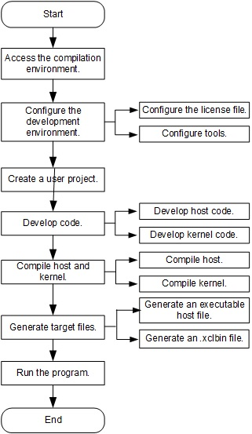

Implementation Process of SDAccel-based Hardware Development
=======================
[切换到中文版](./Implementation_Process_of_SDAccel_based_Hardware_Development_cn.md)

Contents
-------------------------

[SDAccel-based Operation Process](#sec-1)

[Configuring the Development Environment](#sec-2)

[Creating a User Project](#sec-3)

[SDAccel Development](#sec-4)

[SDAccel Simulation](#sec-5)

[Configuring a Project](#sec-6)

[Version Compilation](#sec-7)

SDAccel-based Operation Process
-------------------------

The compilation and execution processes of the SDAccel platform are based on the SDx tool compilation environment and the execution environment that supports FPGA cards.

**Notes**

SDAccel compilation environment and execution environment can be deployed on the same VM.

The SDAccel platform provides two methods for creating a project.

-   Create a project and upload user-developed code to the compilation environment, or develop code on the platform to meet user requirements.

-   Copy an example project, modify parameters, and add user code to meet user requirements.

### User Operation Process

User operation processes include the simulation process and the hardware test process.

#### Simulation Process

#### Hardware Test Process

#### The following table describes each step of the user operation process.

| Procedure                                | Operation                                | Description                              |
| ---------------------------------------- | ---------------------------------------- | ---------------------------------------- |
| Go to the compilation environment.       | Go to the SDx compilation environment.   | Go to the compilation environment in which SDx is installed. |
| Develop user code.                       | Develop user code.                       | Develop host and kernel code based on user requirements. SDAccel supports C/C++ for host code development and C/C++/OpenCl C/Verilog/VHDL for kernel code development. The source files must be stored in the **src** folder in the directory where the user project is located. |
| Configure the development environment.   | Configure the hardware development environment. | Configure the setup.cfg script and run it to configure the hardware development environment. |
| Create a user project.                   | Create a user project.                   | Run a command to create a user project.  |
| Compile source files and generate target files. | Compile source files and generate target files. | After the project configuration is complete, run the compile.sh script to compile, link, and generate the host program, and to compile the kernel, implement synthesis, placing, and routing, and generate the xclbin file. The generated target files are stored in the /prj/bin/ directory. |
| Modify configuration files.              | Modify configuration files according to README.md. | Modify configuration files of AEI_Regsiter.sh and fisclient before registering an image. |
| Register an image.                       | Register an SDAccel image.               | Use AEI_Regsiter.sh to register an SDAccel image with the SDAccel image management module. After the registration, an ID is assigned to the SDAccel image. |
| Check the image registration status.     | Check whether the SDAccel image is successfully registered. | Use the image ID to check whether the SDAccel image is successfully registered. |
| Load the image.                          | Load the image.                          | FpgaCmdEntry, the SDAccel image loading tool in the SDK, supports VM FPGA information query, image loading and query, and virtual LED status query. |
| Go to the execution environment.         | Go to the hardware test environment.     | Go to the hardware test environment.     |
| Develop host code.                       | Develop host code.                       | Develop host code before performing the hardware test. |
| Copy the .xclbin file to the execution environment. | Copy the compiled .xclbin file from the compilation environment to the target directory in the execution environment. | Copy the compiled .xclbin file from the compilation environment to the target directory in the execution environment. |
| Run the host program.                    | Run the host program.                    | Perform the hardware test.               |

Configuring the Development Environment
------------

The SDAccel is stored in the `huaweicloud-fpga/fp1` directory on a VM by default. Configure the hardware development environment before SDAccel development.

#### Step 1 Configure the EDA tool mode.

Open the setup.cfg file in the huaweicloud-fpga/fp1/ directory, and set `FPGA_DEVELOP_MODE` to the required FPGA development tool.

To use SDAccel as a development tool, set the parameter as follows:

`FPGA_DEVELOP_MODE="sdx"`

**Note**
The default development tool is Vivado. Therefore, you need to change Vivado to the selected tool.

#### Step 2 Configure the license file of EDA.

Set `XILINX_LIC_SETUP` in the setup.cfg file to the IP address 2100@100.125.1.240:2100@100.125.1.251 of the license server.

`XILINX_LIC_SETUP="2100@100.125.1.240:2100@100.125.1.251"`

#### Step 3 Configure the version of EDA.

Set `VIVADO_VER_REQ` in the `setup.cfg` file to the version of the selected tool.

To use SDAccel as a development tool, set the parameter of `VIVADO_VER_REQ` as follows:

`VIVADO_VER_REQ="2017.1"`

**Notes**
The default development tool version is 2017.2. Therefore, you need to change 2017.2 to the version of the selected tool.

Only user root has the right to use the Xilinx license file provided by Huawei.

#### Step 4 Complete the development environment configuration.

Run the `setup.sh` script to configure the hardware development environment.

`cd huaweicloud-fpga/fp1`  
`export HW_FPGA_DIR=$(pwd)`  
`source $HW_FPGA_DIR/setup.sh`

**Note**
You can copy all the files of SDAccel to any directory on a VM. The following sections use the default directory as an example.

Creating a User Project
------------

By default, user projects are stored in the `$HW_FPGA_DIR/hardware/sdacel_design/user` directory. Run the `create_prj.sh` script to create a project.

`cd $HW_FPGA_DIR/hardware/sdaccel_design/user`  
`sh create_prj.sh <usr_prj_name> <kernel_mode>`

**Note**
<usr_prj_name> is the user project name and is specified when users create a project. <kernel_mode> is the user project type, and users can select `temp_cl, temp_c, or temp_rtl`. For details, see `$HW_FPGA_DIR/hardware/sdacel_design/user/README.md`.

Implementing SDAccel-based Development
-----------
1. SDAccel supports OpenCL/C/Verilog/VHDL for kernel development. The source files must be stored in the `$HW_FPGA_DIR/hardware/sdaccel_design/user/<usr_prj_name>/src` directory of the `<usr_prj_name>` directory.
2. After the compilation is complete, modify the Makefile in the `$HW_FPGA_DIR/hardware/sdaccel_design/user/<usr_prj_name>/src` directory of `<usr_prj_name>`, and modify variables `HOST_EXE=User host program name` and `KERNEL_NAME=Kernel name compiled by the user`.
3. After the Makefile is modified, go to the `$HW_FPGA_DIR/hardware/sdaccel_design/user/<usr_prj_name>/scripts/` directory and run `sh compile.sh hw` to complete the compilation and generate the executable files of the host program and the .xclbin file.

**Note**
The name of kernel compiled by users must be the same as the name of the kernel module.  
* *Each compilation clears the previously compiled contents. If necessary, back up the compiled files before a new compilation.**

Implementing SDAccel-based Simulation
-----------

SDAccel supports the cpu-emulation and hw-emulation simulation modes.

#### Step 1 Develop host and kernel code.

`cd $HW_FPGA_DIR/hardware/sdaccel_design/user/<usr_prj_name>/src`

The code must be stored in the src directory.

#### Step 2 Configure compilation scripts.

`cd $HW_FPGA_DIR/hardware/sdaccel_design/user/<usr_prj_name>/src`

Configure host and kernel names in the Makefile file.

#### Step 3 Implement simulation compilation.

`cd $HW_FPGA_DIR/hardware/sdaccel_design/user/<usr_prj_name>/scripts`  
`sh compile.sh <emulation_mode>`

#### Step 4 Implement the simulation.

`cd $HW_FPGA_DIR/hardware/sdaccel_design/user/<usr_prj_name>/scripts`  
`sh run.sh emu ../prj/bin/<example_host> ../prj/bin/<xclbin>`

**Note**
For details about how to implement the simulation, see `HW_FPGA_DIR/hardware/sdaccel_design/user/<usr_prj_name>/README.md`.

Configuring a Project
--------

SDAccel supports one-click project building. Modify the `Makefile` file in the `$HW_FPGA_DIR/hardware/SDAccel_design/user/<usr_prj_name>/src/` directory to configure a project.

#### The configuration items include:

-   Host name

-   Kernel name

Version Compilation
------------

Run the `compile.sh` script to compile, link, and generate the host program, and to compile the kernel, implement synthesis, placing, and routing, and generate the target file.

`cd $HW_FPGA_DIR/hardware/sdaccel_design/user/<usr_prj_name>/scripts/`  
`sh compile.sh hw`

**Note**
For details, see `HW_FPGA_DIR/hardware/sdaccel_design/user/<usr_prj_name>/README.md`.  
* *Each compilation clears the previously compiled contents. If necessary, back up the compiled files before a new compilation.**

