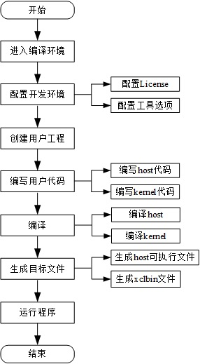

基于SDAccel硬件开发实现流程
=======================

[Switch to the English version](./Implementation_Process_of_SDAccel_based_Hardware_Development.md)

目录
-------------------------

[基于SDAccel的操作流程](#sec-1)

[配置开发环境](#sec-2)

[创建用户工程](#sec-3)

[SDAccel开发](#sec-4)

[SDAccel仿真](#sec-5)

[配置工程](#sec-6)

[启动版本编译](#sec-7)

基于SDAccel的操作流程
-------------------------

SDAccel平台的编译和执行流程基于已安装SDx工具的编译环境和支持硬件的执行环境。

**说明:**

SDAccel编译环境和执行环境可在同一虚拟机上部署。

SDAccel平台提供两种方法以便用户创建工程。

-   第一种是用户自己创建工程，上传用户设计的代码，添加在编译环境对应目录中；或是用户直接在平台中编写代码实现用户需求。

-   第二种是拷贝Example示例工程，按照Example示例工程的操作流程，通过更改参数，添加用户代码实现用户需求。 

### 用户操作流程

用户操作的具体流程分两种：开发仿真操作流程和开发硬件操作流程

#### 开发仿真操作流程

#### 开发硬件操作流程

#### 用户操作流程各个步骤说明如下表所示：

| 步骤            | 操作                          | 说明                                       |
| ------------- | --------------------------- | ---------------------------------------- |
| 进入编译环境        | 进入安装SDx的编译环境                | 进入安装SDx的编译环境。                            |
| 编写用户代码        | 编写用户代码                      | 用户根据自己的需求，编写用户代码（host代码和kernel代码）。SDAccel支持用户使用C/C++开发host代码；支持C/C++/OpenCl C/Verilog或VHDL语言开发kernel。用户编写的源文件必须存放在指定用户工程目录的**src**目录下。 |
| 配置开发环境        | 配置开发环境                      | 配置setup.cfg脚本中相应信息，运行“setup.sh”脚本完成硬件开发环境的配置。 |
| 创建用户的工程       | 创建用户工程                      | 使用命令一键创建用户工程。                            |
| 编译            | 编译                          | 用户完成工程配置之后，执行“compile.sh”脚本完成host文件编译、链接生成目标文件及kernel文件hls、综合、布局布线和产生目标文件流程。 |
| 生成目标文件        | 生成host可执行文件及xclbin文件        | 生成的文件存放在用户工程目录/prj/bin/下。                |
| 配置文件          | 按照文档说明修改相应的配置文件             | 在执行注册操作前，用户需要先修改AEI_Regsiter.sh和fisclient使用的配置文件。 |
| 注册镜像          | 注册SDAccel镜像                 | 用户使用AEI_Regsiter.sh工具向SDAccel镜像管理模块注册SDAccel镜像。完成注册后，用户会获得一个SDAccel镜像ID。 |
| 查询镜像注册情况      | 查询SDAccel镜像是否注册成功           | 使用SDAccel镜像ID查询SDAccel镜像的注册操作是否成功。       |
| 加载镜像          | 加载镜像                        | 在SDK中SDAccel镜像的加载工具FpgaCmdEntry支持租户查询虚拟机上的FPGA信息、加载镜像、查询镜像和虚拟点灯查询功能。 |
| 进入执行环境        | 进入硬件测试环境                    | 进入硬件测试环境。                                |
| 编写host代码      | 编写host代码                    | 执行硬件测试需要在执行环境对应目录上编写host代码               |
| 拷贝xclbin到执行环境 | 从编译环境拷贝已编译的xclbin到执行环境对应目录下 | 从编译环境拷贝已编译的xclbin到执行环境对应目录下。             |
| 运行程序          | 运行程序                        | 执行硬件测试。                                  |

配置开发环境
------------

用户进入VM后，SDAccel默认存放在`huaweicloud-fpga/fp1`目录下。在进行SDAccel开发前，用户需要完成对硬件开发环境的配置。

#### 配置EDA工具模式

用户打开`huaweicloud-fpga/fp1/`路径下的`setup.cfg`文件，根据所要选用的FPGA开发工具，将`FPGA_DEVELOP_MODE`设置相应的工具。

因使用SDAccel作为开发工具，请配置：

`FPGA_DEVELOP_MODE="sdx"`

**说明:**
因为默认的开发工具被设置为vivado，所以需要修改该配置项。

#### 设置EDA工具License

将`setup.cfg`文件中`XILINX_LIC_SETUP`的值配置为License服务器的IP地址，配置如下：

`XILINX_LIC_SETUP="2100@100.125.1.240:2100@100.125.1.251"`

#### 设置EDA工具版本号

将`setup.cfg`文件中`VIVADO_VER_REQ`的值配置成所选工具的版本号。

如果以SDAccel作为开发工具，请配置参数`VIVADO_VER_REQ`如下：

`VIVADO_VER_REQ="2017.1"`

**说明:**
因为默认的开发工具的版本号为2017.2，所以需要修改该配置项。

华为提供的Xilinx软件License仅限root账号使用。

#### 完成开发环境配置

运行`setup.sh`脚本完成硬件开发环境的配置，执行以下命令运行`setup.sh`脚本。

`cd huaweicloud-fpga/fp1`  
`export HW_FPGA_DIR=$(pwd)`  
`source $HW_FPGA_DIR/setup.sh`

**说明:**
用户可将SDAccel的所有文件拷贝至VM的任意路径下使用，下面均以SDAccel默认路径为例进行说明。

创建用户工程
------------

用户的工程默认存放在`$HW_FPGA_DIR/hardware/sdacel_design/user`路径下，提供`create_prj.sh`帮助用户创建新工程。

`cd $HW_FPGA_DIR/hardware/sdaccel_design/user`  
`sh create_prj.sh <usr_prj_name> <kernel_mode>`

**说明:**
<usr_prj_name>为用户工程名称，由用户创建工程时指定，<kernel_mode>为用户工程类型，可选择`temp_cl，temp_c，temp_rtl`。详情请参考[相关文档](../hardware/sdaccel_design/user/README_CN.md)。

SDAccel开发
-----------
1. SDAccel支持用户使用OpenCL/C/Verilog/VHDL语言进行kernel开发，用户源文件必须存放在用户工程目录`<usr_prj_name>`的`$HW_FPGA_DIR/hardware/sdaccel_design/user/<usr_prj_name>/src`目录下。
2. 编写完成后，用户需要修改`<usr_prj_name>`的`$HW_FPGA_DIR/hardware/sdaccel_design/user/<usr_prj_name>/src`目录下的Makefile，修改变量`HOST_EXE = 用户主机程序名`，`KERNEL_NAME = 用户编写的kernel名`。
3. 修改Makefile完成后，进入`$HW_FPGA_DIR/hardware/sdaccel_design/user/<usr_prj_name>/scripts/`目录执行`sh compile.sh hw`完成编译，生成主机程序可执行文件和xclbin文件。

**说明:**
用户编写的kernel名必须与kernel模块名称一致。  
**每次编译会清除掉之前编译的内容，如有需要，请在新编译之前备份已编译的文件。**

SDAccel仿真
-----------

SDAccel支持cpu-emulation和hw-emulation两种仿真模式。

#### 编写主机程序和kernel代码

`cd $HW_FPGA_DIR/hardware/sdaccel_design/user/<usr_prj_name>/src`

编写代码必须放在src目录下。

#### 配置编译脚本

`cd $HW_FPGA_DIR/hardware/sdaccel_design/user/<usr_prj_name>/src`

用户修改“Makefile”文件，配置host、kernel名称。

#### 执行仿真编译

`cd $HW_FPGA_DIR/hardware/sdaccel_design/user/<usr_prj_name>/scripts`  
`sh compile.sh <emulation_mode>`

#### 执行仿真

`cd $HW_FPGA_DIR/hardware/sdaccel_design/user/<usr_prj_name>/scripts`  
`sh run.sh emu ../prj/bin/<example_host> ../prj/bin/<xclbin>`

**说明:**
仿真具体使用方法请参考：`HW_FPGA_DIR/hardware/sdaccel_design/user/<usr_prj_name>/README.md`。

配置工程
--------

SDAccel提供一键式的版本构建解决方案，用户需要在`$HW_FPGA_DIR/hardware/SDAccel_design/user/<usr_prj_name>/src/`目录下完成对`Makefile`文件的修改，从而实现对工程的配置。

#### 配置内容包括

-   host名称

-   kernel名称

启动版本编译
------------

用户执行`compile.sh`脚本即可完成host编译、链接、生成可执行文件及kernel综合、布局布线和产生目标文件等流程。

`cd $HW_FPGA_DIR/hardware/sdaccel_design/user/<usr_prj_name>/scripts/`  
`sh compile.sh hw`

**说明:**
具体使用方法请参考：`HW_FPGA_DIR/hardware/sdaccel_design/user/<usr_prj_name>/README.md`。  
**每次编译会清除掉之前编译的内容，如有需要，请在新编译之前备份已编译的文件。**
