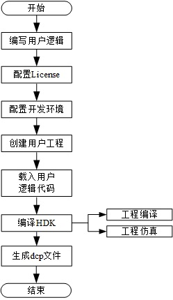

基于vivado的硬件开发实现流程
=======

[Switch to the English version](./Implementation_Process_of_Vivado_based_Hardware_Development.md)

本章节介绍Vivado的操作流程、配置开发环境。

目录
-------
[了解基于Vivado的操作流程](#a)

[配置开发环境](#b)

[创建用户工程](#c)

[FPGA开发](#d)

[FPGA仿真](#e)

[配置工程](#f)

[启动版本编译](#g)

了解基于Vivado的操作流程
-------

### 用户操作流程

#### 用户操作的具体流程如图所示。

#### 用户操作流程各个步骤说明如表所示。

| 步骤              | 操作                    | 说明                                       |
| --------------- | --------------------- | ---------------------------------------- |
| 编写用户逻辑          | 编写用户逻辑                | 用户根据自己的需求，编写用户逻辑（UL）。FPGA HDK支持用户使用Verilog或VHDL语言开发FPGA。 |
| 配置License       | 配置License             | 请填写正确路径，HDK方可根据路径获取License。配置License为配置开发环境的前提条件。 |
| 配置开发环境          | 配置开发环境                | 运行“setup.sh”脚本完成硬件开发环境的配置。               |
| 创建用户的工程         | 创建用户工程                | 用户的工程放在指定路径，使用创建用户工程的命令，即可实现一键创建用户工程 。   |
| 用户编写代码或载入用户逻辑代码 | 用户编写代码或将用户逻辑代码载入自己的工程 | 用户编写的源文件必须存放在指定用户工程目录的**src**文件夹下。       |
| 编译HDK           | 工程仿真                  | 实现配置仿真宏和参数、编写激励、编写测试用例、配置编译脚本和执行仿真等步骤的操作。 |
|                 | 工程编译                  | 用户完成工程配置之后，用户执行“build.sh”脚本可完成源文件加密、综合、布局布线和产生目标文件等流程。 |
| 生成dcp文件         | 生成dcp文件               | 生成的dcp文件存放在.../prj/build/checkpoints/to_facs/下。 |

<a name="b"></b>
配置开发环境
--------

用户进入VM后，FPGA HDK默认存放在huaweicloud-fpga/fp1目录下。在进行FPGA开发前，用户需要完成对硬件开发环境的配置。

### 步骤一 设置Vivado工具License。

用户打开huaweicloud-fpga/fp1/路径下的`setup.cfg`文件，将文件中`XILINX_LIC_SETUP`的值配置为License服务器的IP地址`2100@100.125.1.240:2100@100.125.1.251`。

`XILINX_LIC_SETUP="2100@100.125.1.240:2100@100.125.1.251"`

**说明：**华为提供的Xilinx软件License仅限root账号使用。

### 步骤二 配置开发环境。

运行“setup.sh”脚本完成硬件开发环境的配置，执行以下命令运行“setup.sh”脚本。

`cd huaweicloud-fpga/fp1`  
`export HW_FPGA_DIR=$(pwd)`  
`source $HW_FPGA_DIR/setup.sh`

**说明：**用户可将HDK的所有文件拷贝至VM的任意路径下使用，下面均以HDK默认路径为例进行说明。

<a name="c"></c>
创建用户工程
------------

用户的工程默认存放在`$HW_FPGA_DIR/hardware/vivado_design/user`路径下，提供`create_prj.sh`帮助用户创建新工程。

`cd $HW_FPGA_DIR/hardware/vivado_design/user`  
`sh create_prj.sh <usr_prj_name>`
<a name="d"></d>
FPGA开发
--------

FPGA
HDK支持用户使用Verilog/VHDL语言进行FPGA开发，用户编写的源文件必须存放在用户工程目录<usr_prj_name>的src文件夹下。

`cd $HW_FPGA_DIR/hardware/vivado_design/user/<usr_prj_name>/src`
<a name="e"></e>
FPGA仿真
--------

FPGA HDK提供了一套基于SystemVerilog-2012语法标准的通用FPGA仿真平台，支持业界主流仿真工具。为了帮助用户快速搭建自己的仿真平台，平台构架采用业务解耦性设计，实现了Testbench与Testcase分离。Testbench位于`$HW_FPGA_DIR/hardware/vivado_design/lib/sim`目录下。

用户根据UL修改仿真平台包含以下操作步骤。

###  配置仿真宏和参数。

`cd $HW_FPGA_DIR/hardware/vivado_design/user/<usr_prj_name>/sim/scripts`

用户修改`project_settings.cfg`文件，如用户需要配置仿真平台中的宏SIM_ON有效，文件修改如下。

`#SIM_MACRO=“<SIM_ON>”`

### 编写激励。

`cd $HW_FPGA_DIR/hardware/vivado_design/vivado_design/lib/sim/doc/`

用户根据该目录下`quick_start.md`提供的API设计自己的激励并传递给仿真平台。

### 编写测试用例。

`cd $HW_FPGA_DIR/hardware/vivado_design/user/<usr_prj_name>/sim/tests`

支持用户使用C语言或SystemVerilog语言设计测试用例。

### 配置编译脚本。

`cd $HW_FPGA_DIR/hardware/vivado_design/user/<usr_prj_name>/sim`

用户修改“Makefile”文件，配置仿真工具和用例名。

### 执行仿真。

`cd $HW_FPGA_DIR/hardware/vivado_design/user/<usr_prj_name>/sim`

`make TC=<TC_NAME>`

**说明：**FPGA仿真具体使用方法请参考`$HW_FPGA_DIR/hardware/vivado_design/lib/sim/doc/quick_start.md`文档。

<a name="f"></f>
配置工程
--------

FPGA HDK提供一键式的FPGA版本构建解决方案，用户需要在`$HW_FPGA_DIR/hardware/vivado_design/user/<usr_prj_name>/prj`目录下完成对`usr_prj_cfg`文件的修改，从而实现对工程的配置。

### 配置内容包括

-   工程名

-   顶层模块名

-   综合策略

-   布局布线策略

-   工程构建模式

-   用户逻辑约束

**说明：**具体配置方法请参考`usr_prj_cfg`文件中的注释说明。

<a name="g"></g>
启动版本编译
------------

用户执行build.sh脚本即可一键式完成综合、布局布线2个流程。

`cd $HW_FPGA_DIR/hardware/vivado_design/user/<usr_prj_name>/prj`  
`sh ./build.sh`

如需完成源文件加密、和产生目标文件的流程，请参见：`huaweicloud-fpga/fp1/hardware/vivado_design/lib/template/prj/README.md`
