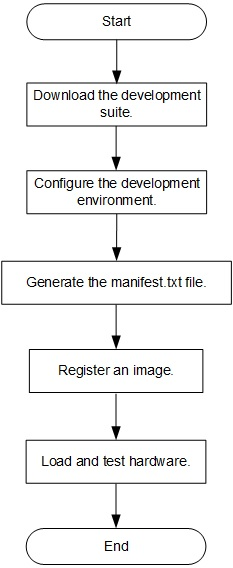

Using Huawei Cloud Based on Offline SDAccel Development
=======================

[切换到中文版](./SDAccel-based_offline_development_online_use_process_guidance_cn.md)

**Prerequisites** 
You have implemented the kernel compilation offline and generated an .xclbin file.

Contents
-------------------------

[Overall Operation Process](#sec-1)

[Downloading the Development Suite](#sec-2)

[Configuring the Development Environment](#sec-3)

[Generating the manifest.txt File](#sec-4)

[Registering an Image](#sec-5)

[Loading and Testing Hardware](#sec-6)

<a id="sec-1" name="sec-1"></a>
Overall Operation Process
------------



<a id="sec-2" name="sec-2"></a>
Downloading the Development Suite
------------

After applying for a Huawei cloud virtual machine (VM), download the development suite to the VM.

+ For connection over HTTPS, run the `git clone https://github.com/Huawei/huaweicloud-fpga.git` command to download the suite.

+ For connection over SSH, run the `git clone git@github.com:Huawei/huaweicloud-fpga.git` command to download the suite.

<a id="sec-3" name="sec-3"></a>
Configuring the Development Environment
------------

**Note**
Only user **root** has the right to use the Xilinx license file provided by Huawei.

SDAccel is stored in the `huaweicloud-fpga/fp1` directory of the VM by default. Configure the hardware development environment before SDAccel development.

#### Setting an Intranet DNS

For details about how to set an intranet DNS, see section 1.2.2 in **README.md** in the root directory `huaweicloud-fpga`.

#### Installing and Configuring the FPGA Image Management Tool

For details about how to install and configure the FPGA image management tool, see section 1.2.3 in **README.md** in the root directory `huaweicloud-fpga`.

#### Setting the Development Mode and Version for EDA

Open the `setup.cfg` file in the `huaweicloud-fpga/fp1/` directory, and set `FPGA_DEVELOP_MODE` to **SDAccel** and `VIVADO_VER_REQ` to **2017.4.op**.

```bash
FPGA_DEVELOP_MODE="sdx"
VIVADO_VER_REQ="2017.4.op"
```

#### Configuring the EDA License

Set `XILINX_LIC_SETUP` in the `setup.cfg` file to the IP address of the license server. (Set this parameter based on the region where you apply for the VM.)

CN North-Beijing1:
`XILINX_LIC_SETUP="2100@100.125.1.240:2100@100.125.1.251"`

CN South-Guangzhou:
`XILINX_LIC_SETUP="2100@100.125.16.137:2100@100.125.16.138"`

CN East-Shanghai2:
`XILINX_LIC_SETUP="2100@100.125.17.108:2100@100.125.17.109"`

#### Configuring the Development Environment

Run the `setup.sh` script to configure the hardware development environment.

```bash
cd huaweicloud-fpga/fp1 
export HW_FPGA_DIR=$(pwd)
source $HW_FPGA_DIR/setup.sh
```

<a id="sec-4" name="sec-4"></a>
Generating the manifest.txt File
------------

Create a project to store the .xclbin file.

```bash
cd huaweicloud-fpga/fp1/hardware/sdaccel_design/user
sh create_prj.sh usr_prj temp_cl
```

Upload the `xclbin` file generated offline to the `usr_prj/prj/bin/` folder you have created.

The **manifest.txt** file used for image registration is not generated during offline development. Therefore, the file needs to be generated separately.

```bash
cd huaweicloud-fpga/fp1/hardware/sdaccel_design/user/usr_prj/scripts
sh ../../../lib/scripts/creat_ocl_manifest.sh ./
```

<a id="sec-5" name="sec-5"></a>
Registering an Image
------------

Run the following script to register an image. For details, see section 2.1.2 in **README.md** in the root directory `huaweicloud-fpga`.

```bash
sh AEI_Register.sh -n [AEI_name] -d [AEI_Description]
```

<a id="sec-6" name="sec-6"></a>
Loading and Testing Hardware
------------

Create a folder for the user driver software.

```bash
cd huaweicloud-fpga/fp1/software/app/sdaccel_app
mkdir usr_app
cp -r ./mmult_hls/* ./usr_app
cd usr_app
```

Upload the driver software to the `usr_app` folder you have created and replace the `test-cl.cpp` file.

Run **run.sh** to load and test hardware.

```bash
make
sh run.sh mmult huaweicloud-fpga/fp1/hardware/sdaccel_design/user/usr_prj/prj/bin/xxx.xclbin
```

**Note**

**xxx.xclbin** is the name of the file you have uploaded.
Run **sh run.sh -h** to query how to use **run.sh**.
