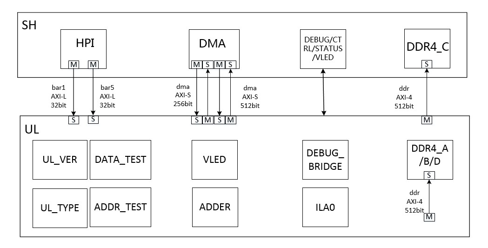
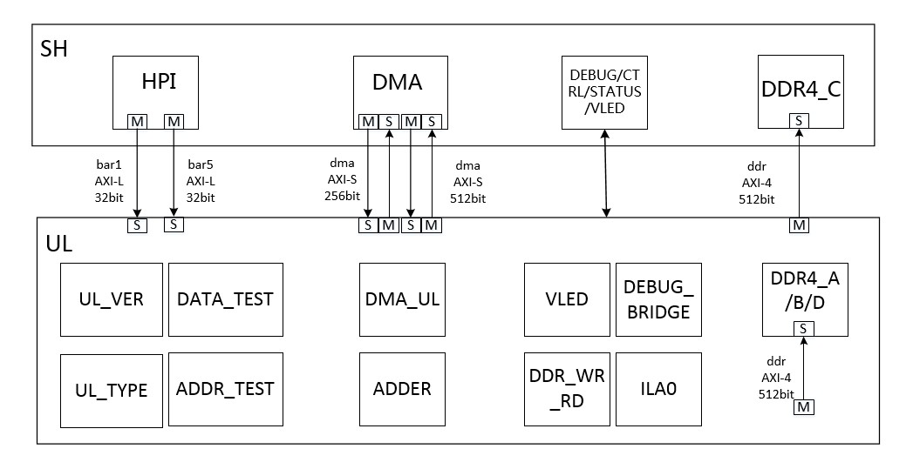
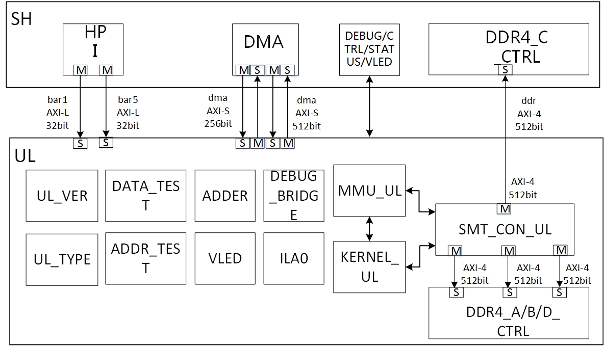

# 目录结构

[Switch to the English version](./README.md)

Documents文件夹下，总共包含如下文档：

* [documents](#documents_dir)/
  - example1.jpg 示例1的逻辑结构框图；
  - example2.jpg 示例2的逻辑结构框图；
  - example3.jpg 示例3的逻辑结构框图；
  - interface_signal_cn.md 静态逻辑和动态逻辑之间接口信号说明；  
  - pcie_memory_map_cn.md Pcie 存储空间划分说明；  
  - requirements for tools and license_cn.md 工具及license要求说明；  
  - sh_ul_interface.jpg 静态逻辑和动态逻辑之间接口示图；  
  - README_CN.md（本文档） 

# 目录说明

* example1

  

  - example1的框图中，UL_VER的功能是例化ro_reg_inst CBB，通过`app`读取到的版本号是example1发布的时间信息。
  - UL_TYPE的功能是例化ro_reg_inst CBB，通过读该寄存器可获得当前example1的版本信息值。
  - DATA_TEST的功能是例化ts_reg_inst CBB，实现对`写入数据取反`功能。
  - ADDR_TEST的功能是例化ts_addr_reg_inst CBB，实现对最近一次操作`地址的取反`功能。
  - ADDER例化`两个rw_reg_inst CBB`分别为加法器的加数和被加数，再例化`一个ro_reg_inst CBB`实现加法器的结果读取。
  - VLED在`PF`下面访问，由静态提供管脚给动态用户使用，用户可以读写VLED，确保`UL`部分工作正常。VLED例化一组rw_reg_inst CBB将输出结果链接到VLED。
  - 所有的DDR部分用户接口输入信号全部例化`unused_ddr_a_b_d_inst.h`和`unused_ddr_c_inst.h `赋值为0。
  - 例化DEBUG_BRIDGE和ILA0，供用户调试使用，ILA的调试信号开放`八根`。

* example2

  

  - example2的框图中，UL_VER的功能是例化ro_reg_inst CBB，版本号是通过`app`读取到的example2发布的时间信息。
  - UL_TYPE的功能是例化ro_reg_inst CBB，通过读该寄存器可获得当前example2的版本信息值。
  - DATA_TEST的功能是例化ts_reg_inst CBB，实现对`写入数据取反`功能。
  - ADDR_TEST的功能是例化ts_addr_reg_inst CBB，实现对最近一次操作`地址的取反`功能。
  - DMA_UL的功能是向host发起读报文请求再将收到的报文送回到host，实现数据`x86->host->用户逻辑->host->x86`路径的`dma数据环回`。
  - DDR_WR_RD实现对`4组`DDR的数据通道的读写访问功能。
  - VLED在`PF`下面访问，由静态提供管脚给动态用户使用，用户可以读写VLED，确保`UL`部分工作正常。
  - VLED例化一组rw_reg_instCBB将输出结果连接到VLED。
  - ADDER是加法器，实现对输入数据求和。
  - 例化DEBUG_BRIDGE和ILA0，供用户调试使用，ILA的调试信号开放`八根`。

* example3

  - 
  - 1 example3功能概述
  - example3支持DMA只写DDR、DMA只读DDR以及报文PROCESS（注：PROCESS模式是指报文先写入DDR，KERNEL进行处理，再从DDR读出报文回送CPU）三种功能。当前报文具体属于哪种处理模式取决于用户需要并根据SHELL2UL BD中opcode域确定；在CPU mbuf报文src_addr所指向的payload存储区域起始32字节存放hardacc字段，hardacc主要包含报文写DDR地址、报文读DDR地址等信息；DDR读写长度由SHELL2UL BD中length域指定（参见《User_Developlent_Guide_for_an_FACS_cn.docx》）。
  - ​
  - 2 数据处理流程
  - 2.1 DMA只写DDR模式
  - 1）APP经由DPDK driver向MMU_UL下达DMA写DDR BD，
  - 2）MMU_UL首先向SHELL发起读src_addr 32字节hardacc命令获取到DDR写地址，
  - 3）然后MMU_UL继续发起读报文payload命令并将读出的报文payload写入指定DDR地址中；
  - 4）最后MMU_UL需要构造一个尾包发给SHELL以作为本次DMA写DDR命令对CPU的响应，表示本次DMA写DDR操作完成。
  - 2.2 DMA只读DDR模式
  - 1）APP经由DPDK driver向MMU_UL下达DMA读DDR BD，
  - 2）MMU_UL首先向SHELL发起读src_addr 32字节hardacc命令获取到DDR读地址，
  - 3）然后MMU_UL从指定DDR地址中读出报文并通过UL2SHELL data接口送出；
  - 4）最后MMU_UL需要构造一个尾包发给SHELL以作为本次DMA读DDR命令对CPU的响应，表示本次DMA读DDR操作完成。
  - 2.3 报文process模式
  - 1）APP经由DPDK driver向MMU_UL下达先写后读DDR BD，
  - 2）MMU_UL首先向SHELL发起读src_addr 32字节hardacc命令获取到DDR读写地址，
  - 3）然后MMU_UL继续发起读报文payload命令并将读出的报文payload写入指定DDR写地址中并通知KERNEL_UL模块，接着KERNEL_UL模块从DDR写地址（从hardacc获取到的）中读出报文做相关加速处理后写入DDR读地址（从hardacc获取到的）并知会MMU_UL模块，
  - 4）MMU_UL再从指定DDR读地址中读出报文并通过UL2SHELL data接口送出；
  - 5）最后MMU_UL需要构造一个尾包发给SHELL以作为本次PROCESS命令对CPU的响应，表示本次PROCESS操作完成。
  - ​
  - 3 内部模块划分及相关功能、接口说明
  - example3的框图中，UL_VER的功能是例化ro_reg_inst CBB，版本号是通过`app`读取到的example3发布的时间信息。
  - UL_TYPE的功能是例化ro_reg_inst CBB，通过读该寄存器可获得当前example3的版本信息值。
  - DATA_TEST的功能是例化ts_reg_inst CBB，实现对`写入数据取反`功能。
  - ADDR_TEST的功能是例化ts_addr_reg_inst CBB，实现对最近一次操作`地址的取反`功能。
  - MMU_UL的功能：在PROCESS模式下，其功能一是向host发起读数据请求再将收到的数据写入DDR，二是读取用户写入DDR处理后的数据并送往host；在DMA只写DDR模式下，其功能是向host发起读数据请求再将收到的数据写入DDR，并构造尾包携带hardacc送往host；在DMA只读DDR模式下，其功能是读取存放于DDR中的数据并送往host。
  - KERNEL_UL的功能是读取MMU_UL写入DDR的数据，处理完成后再写入DDR，等待MMU_UL取走这些数据。
  - MMU_UL与KERNEL_UL之间、MMU_UL内部MMU_TX_UL与MMU_RX_UL（注：MMU_TX_UL与MMU_RX_UL为MMU_UL内部的两个模块）之间的接口说明：为信息传递接口，主要是传递src_addr、dst_addr、opcode、ddr读写地址、length等信息。
  - SMT_CON的功能是汇聚MMU_UL及KERNEL_UL的DDR控制器读写请求并进行仲裁，然后将仲裁后的读写DDR控制器信号与4组DDR控制器模块相连。SMT_CON接口说明：一端是连接MMU_UL、KERNEL_UL的读写DDR控制器请求接口信号，一端是连接4组DDR控制器。
  - DDRX_72B_TOP为DDR控制器，UL部分一共3组，SHELL部分1组通过AXI4接口引给UL访问。其接口为：一端与SMT_CON相连，一端连接DDR PHY，并支持HPI接口的CPU配置、读取调试寄存器功能。完成DDR RAM的读写控制。
  - VLED在`PF`下面访问，由静态提供管脚给动态用户使用，用户可以读写VLED，确保`UL`部分工作正常。
  - VLED例化一组rw_reg_instCBB将输出结果连接到VLED。
  - ADDER是加法器，实现对输入数据求和。
  - 例化DEBUG_BRIDGE和ILA0，供用户调试使用，ILA的调试信号开放`八根`。
  - ​
  - 4 用户移植说明及设计约束
  - 用户可借鉴本example3设计完成自己的DMA只写DDR、DMA只读DDR功能，也可以借鉴以完成先写后读DDR对报文完成加速处理的功能。
  - 4.1 DMA只写DDR功能或DMA只读DDR功能
  - 用户基本上可以直接调用华为已实现的设计，在对APP相关接口函数调用时稍作适配（例如DDR使用方式，用几片，哪片DDR等等），逻辑部分基本可直接使用。
  - 4.2 PROCESS处理功能
  - 用户需要注意对KERNEL_UL相关的各接口进行适配，具体包括：
  - 1）KERNEL_UL与MMU_UL之间为AXI4信息接口，传递报文BD信息（具体内容参见FACS用户手册）；2）KERNEL_UL与SMT_CON_UL之间为DDR读写请求接口，用户可以根据KERNEL_UL模块对DDR控制器的实际读写请求向SMT_CON_UL发起读写DDR控制器，建议读写客户数与本参考设计保持一致，这样将可直接重用SMT_CON_UL模块；
  - 3）另外，用户还需要为KERNEL_UL添加CPU访问接口，以完成CPU对KERNEL_UL模块的寄存器/表项配置及调试寄存器读写等功能。
  - 4.3 几点设计约束
  - 1）本参考设计只支持单报文在单片16G Byte的DDR内部读写（注：由DPDK驱动负责该限制处理），不支持单报文跨两片或多片DDR进行存储，这是受限于DDR控制器的应用方式；
  - 2）当工作于DMA只写DDR、DMA只读DDR模式时，需要由APP（即用户自己）来保证正常读写顺序问题，即必须是某报文先写入了某一片DDR地址，然后才能从该地址区域读出该报文；
  - 3）工作于三种模式中的任何一种模式，UL接收方向均需要构造尾包作为本次操作对CPU的响应，这是为了配合驱动软件完成相关处理。

* interface_signal.md
  - 描述了用户逻辑和静态逻辑之间的所有接口信号。 
* requirements for tools and license_cn.md  
  - 描述了fpga_design正常运行的工具及`license`要求说明。
* pcie_memory_map_cn.md  
  - 主要描述`pcie`的存储空间划分。
* sh_ul_interface.jpg   
  - 用结构框图的方式，主要描述静态逻辑和用户设计的动态逻辑之间可用的`接口类型和接口位宽`信息;
  - SH部分为逻辑接口的静态部分，用户只需要知道其组成即可;
  - UL部分为逻辑接口的动态部分，用户可以在这部分实现自己的个性化需求。
* README_CN.md
  - 即本文档，用于介绍其他文档。
