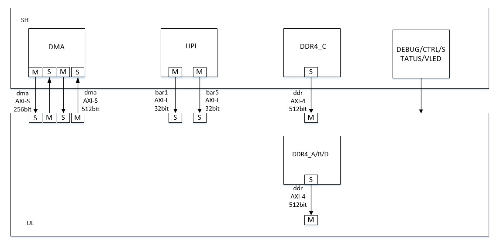

# Overview

[切换到中文版](./interface_signal_cn.md)

* The FPGA acceleration card is connected to the CPU through the PCIe3.0 x16 interface with four external DDR4s. The FPGA acceleration card supports high-speed device interconnection interfaces and 100 GB Ethernet ports.FPGA logic consists of `Shell and custom logic`.
  - Shell (SH): indicates static logic provided by FACS, including peripheral interfaces such as PCIe and DDR4.
  - Custom logic (CL): indicates dynamic logic developed by users.

  You need to use SH and CL to compile the `AEI file` of FPGA images.      
  This document describes hardware interfaces between SH and CL and the function of shell.  

# Shell Function
* Provides access to PCIe BAR1/BAR5. 
* Provides access to the PCIe DMA channel.
* Provides access to one DDR4 mapping space.
* Implements debugging, status, and control functions.

# Shell interfaces
The shell function is connected to user logic through the AXI-Lite or AXI4 interface.
* The 32-bit AXI-Lite interface is used for BAR1/BAR5 space access.
* The 512-bit AXI4 interface is used for DMA channel access.
* The 512-bit AXI4 interface is used for one DDR4 mapping space access.
  ​	
# Clocks and Reset Signals
* **clk_100m dma** indicates the AXI4 interface clock for channel access, and **rst_100m** indicates synchronous reset.
* **clk_200m** indicates the AXI4 interface clock for DDR4 mapping space access, and **rst_200m** indicates synchronous reset.
* **clk_hpi** indicates the AXI4 interface clock for BAR1/BAR5 space access, and **rst_hpi** indicates synchronous reset.
* The clock sources share the same PLL/VCO output and have a strict phase relationship. The frequency of the **clk_hpi** clock is 200 MHz.

# DMA Channel Access Interface
* Slave signals of the AXI4 interface provided by shell are as follows:
  - cl2sh_dmas3_tlast
  - cl2sh_dmas3_tdata
  - cl2sh_dmas3_tkeep
  - cl2sh_dmas3_tvalid
  - sh2cl_dmas3_tready

* Master signals of the AXI4 interface provided by shell are as follows:
  - sh2cl_dmam1_tlast
  - sh2cl_dmam1_tdata[511:0]
  - sh2cl_dmam1_tkeep[63:0]
  - sh2cl_dmam1_tvalid
  - cl2sh_dmam1_tready

# DDR4 Mapping Space Access Interface
* Write address signals of the AXI4 interface provided by shell are as follows:
  - cl2sh_ddr_awid[3:0]
  - cl2sh_ddr_awaddr[63:0]
  - cl2sh_ddr_awlen[6:0]
  - cl2sh_ddr_awsize[6:0]
  - cl2sh_ddr_awvalid
    sh2cl_ddr_awready

* Write data signals of the AXI4 interface provided by shell are as follows: 
  - cl2sh_ddr_wid[3:0]
  - cl2sh_ddr_wdata[511:0]
  - cl2sh_ddr_wstrb[63:0]
  - cl2sh_ddr_wlast
  - cl2sh_ddr_wvalid
  - sh2cl_ddr_wready

* Write response signals of the AXI4 interface provided by shell are as follows: 
  - sh2cl_ddr_bid[3:0]
  - sh2cl_ddr_bresp[1:0]
  - sh2cl_ddr_bvalid
  - cl2sh_ddr_bready

* Read address signals of the AXI4 interface provided by shell are as follows: 
  - cl2sh_ddr_arid[3:0]
  - cl2sh_ddr_araddr[63:0]
  - cl2sh_ddr_arlen[6:0]
  - cl2sh_ddr_arsize[6:0]
  - cl2sh_ddr_arvalid
  - sh2cl_ddr_arready

* Read data/response signals of the AXI4 interface provided by shell are as follows: 
  - sh2cl_ddr_rid[3:0]
  - sh2cl_ddr_rdata[511:0]
  - sh2cl_ddr_rresp[1:0]
  - sh2cl_ddr_rlast
  - sh2cl_ddr_rvalid
  - cl2sh_ddr_rready

# PCIe BAR1 Access Interface
* Write address signals of the BAR1 AXI-Lite interface provided by shell are as follows:
  - sh2bar1_awvalid
  - sh2bar1_awaddr[31:0]
  - bar12sh_awready

* Write data signals of the BAR1 AXI-Lite interface provided by shell are as follows:
  - sh2bar1_wvalid    
  - sh2bar1_wdata[31:0]     
  - sh2bar1_wstrb     
  - bar12sh_wready    

* Write response signals of the BAR1 AXI-Lite interface provided by shell are as follows:
  - bar12sh_bvalid
  - bar12sh_bresp 
  - sh2bar1_bready

* Read address signals of the BAR1 AXI-Lite interface provided by shell are as follows:
  - sh2bar1_arvalid
  - sh2bar1_araddr[31:0] 
  - bar12sh_arready

* Read data/response signals of the BAR1 AXI-Lite interface provided by shell are as follows:
  - bar12sh_rvalid 	
  - bar12sh_rdata[31:0]  
  - bar12sh_rresp  
  - sh2bar1_rready
    ​    
# PCIe BAR5 Access Interface
* Write address signals of the BAR5 AXI-Lite interface provided by shell are as follows:
  - sh2bar5_awvalid
  - sh2bar5_awaddr[31:0]
  - bar52sh_awready

* Write data signals of the BAR5 AXI-Lite interface provided by shell are as follows:
  - sh2bar5_wvalid    
  - sh2bar5_wdata[31:0]     
  - sh2bar5_wstrb     
  - bar52sh_wready    

* Write response signals of the BAR5 AXI-Lite interface provided by shell are as follows:
  - bar52sh_bvalid
  - bar52sh_bresp 
  - sh2bar5_bready

* Read address signals of the BAR5 AXI-Lite interface provided by shell are as follows:
  - sh2bar5_arvalid
  - sh2bar5_araddr[31:0] 
  - bar52sh_arready

* Read data/response signals of the BAR5 AXI-Lite interface provided by shell are as follows:
  - bar52sh_rvalid 	
  - bar52sh_rdata[31:0]  
  - bar52sh_rresp  
  - sh2bar5_rready   

