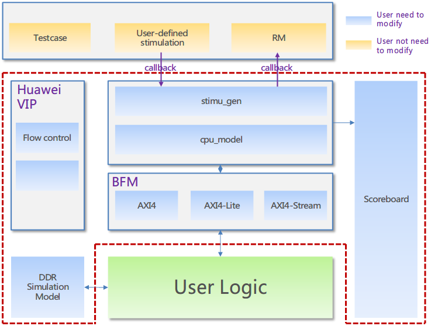
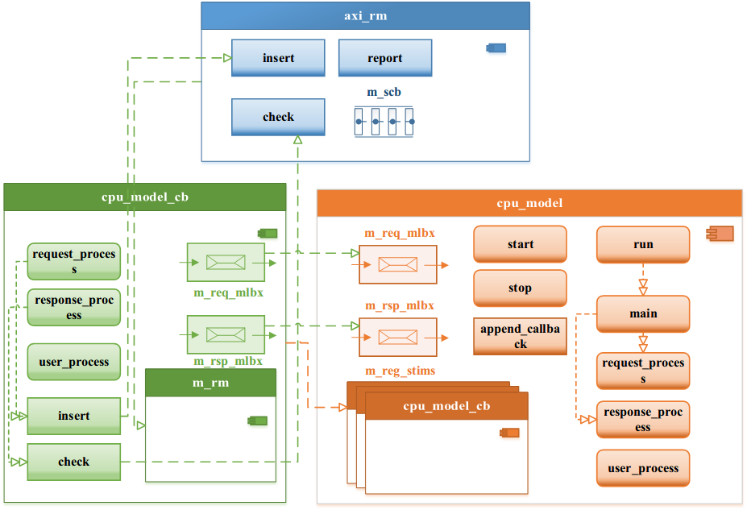

# 仿真平台用户指导

[Switch to the English version](./user_guide.md)

<div id="table-of-contents">
<h2>目录</h2>
<div id="text-table-of-contents">
<ul>
<li><a href="#sec-1">1. <b>简介</b></a></li>
<li><a href="#sec-2">2. <b>仿真平台总体介绍</b></a>
<ul>
<li><a href="#sec-2-1">2.1. <b>FACS仿真平台简介</b></a></li>
<li><a href="#sec-2-2">2.2. <b>仿真平台目录结构</b></a>
<ul>
<li><a href="#sec-2-2-1">2.2.1. <b>仿真目录、文件详细说明</b></a></li>
</ul>
</li>
<li><a href="#sec-2-3">2.3. <b>验证特性</b></a></li>
<li><a href="#sec-2-4">2.4. <b>验证组件总览</b></a></li>
<li><a href="#sec-2-5">2.5. <b>数据结构</b></a></li>
<li><a href="#sec-2-6">2.6. <b>总线功能模型</b></a>
<ul>
<li><a href="#sec-2-6-1">2.6.1. <b>总线功能模型的功能</b></a></li>
<li><a href="#sec-2-6-2">2.6.2. <b>总线功能模型的设计</b></a></li>
</ul>
</li>
<li><a href="#sec-2-7">2.7. <b>激励组件介绍</b></a>
<ul>
<li><a href="#sec-2-7-1">2.7.1. <b>激励组件的功能</b></a></li>
<li><a href="#sec-2-7-2">2.7.2. <b>激励组件的设计</b></a></li>
</ul>
</li>
<li><a href="#sec-2-8">2.8. <b>检查器简介</b></a>
<ul>
<li><a href="#sec-2-8-1">2.8.1. <b>检查器的功能</b></a></li>
<li><a href="#sec-2-8-2">2.8.2. <b>检查器的设计</b></a></li>
</ul>
</li>
<li><a href="#sec-2-9">2.9. <b>测试环境的简介</b></a></li>
</ul>
</li>
<li><a href="#sec-3">3. <b>仿真平台理念</b></a>
<ul>
<li><a href="#sec-3-1">3.1. <b>仿真平台分层</b></a></li>
</ul>
</li>
<li><a href="#sec-4">4. <b>仿真平台的应用</b></a>
<ul>
<li><a href="#sec-4-1">4.1. <b>仿真平台使用流程</b></a>
</li>
<li><a href="#sec-4-2">4.2. <b>仿真平台脚本</b></a>
<ul>
<li><a href="#sec-4-2-1">4.2.1. <b>Makefile文件介绍</b></a></li>
<li><a href="#sec-4-2-2">4.2.2. <b>Makefile使用</b></a></li>
</ul>
</li>
<li><a href="#sec-4-3">4.3. <b>仿真平台用户接口<b></a>
<ul>
<li><a href="#sec-4-3-1">4.3.1. <b>axi_stims.sv<b></a></li>
<li><a href="#sec-4-3-2">4.3.2. <b>cpu_model_cb<b></a></li>
</ul>
</li>
<li><a href="#sec-4-4">4.4. <b>仿真平台用户配置</b></a>
<ul>
<li><a href="#sec-4-4-1">4.4.1. <b>配置文件格式</b></a></li>
<li><a href="#sec-4-4-2">4.4.2. <b>增加配置项</b></a></li>
</ul>
</li>
</ul>
</li>
<li><a href="#sec-5">5. <b>示例</b></a>
<ul>
<li><a href="#sec-5-1">5.1. <b>示例1</b></a>
<ul>
<li><a href="#sec-5-1-1">5.1.1. <b>示例1简介</b></a></li>
<li><a href="#sec-5-1-2">5.1.2. <b>示例1说明</b></a></li>
<li><a href="#sec-5-1-3">5.1.3. <b>示例1使用方法</b></a></li>
</ul>
</li>
<li><a href="#sec-5-1">5.2. <b>示例2</b></a>
<ul>
<li><a href="#sec-5-1-1">5.2.1. <b>示例2简介</b></a></li>
<li><a href="#sec-5-1-2">5.2.2. <b>示例2说明</b></a></li>
<li><a href="#sec-5-1-3">5.2.3. <b>示例2使用方法</b></a></li>
</ul>
</li>
</ul>
</li>
<li><a href="#sec-6">6. <b>附录</b></a></li>
</ul>
</div>
</div>

<a id="sec-1" name="sec-1"></a>

## **简介**

---

本文主要内容为如何使用**FACS仿真平台**进行逻辑的验证。本文包括如下内容：

- 对Testbench的简单描述
  - Testbench支持的特性
  - 如何使用Testbench
- Testbench的理念
- 如何向Testbench中添加组件
- 如何创建测试用例
- 通过示例说明如何使用Testbench

<a id="sec-2" name="sec-2"></a>

## **仿真平台整体介绍**

---

本章内容主要包括**FACS仿真平台**的简介、FACS仿真平台支持的特性以及FACS仿真平台的基本架构介绍。

**FACS仿真平台**在下文中将使用缩略语**Testbench**、**TB**或者**仿真平台**进行描述。

<a id="sec-2-1" name="sec-2-1"></a>

### **FACS仿真平台简介**

---

Testbench是为了完成对DUT的验证而搭建的仿真验证环境。FACS仿真平台是一款能够方便用户在FACS环境下进行验证工作的Testbench。
FACS Testbench由多个验证组件组成，每个验证组件都是一个经过封装的对某个接口协议、功能或验证环境的集合。
所有的验证组件具有统一的架构，并且分别完成不同的工作。这些组件组合在一起共同构成了整个Testbench。

由于Testbench是用户对DUT进行仿真的主体，所以一个完整的Testbench应该具有如下特性：

- 用户自定义激励的产生与发送
- DUT接口时序的模拟
- 能够对DUT的结果进行检查

FACS仿真平台为通用仿真平台，不仅具用普通Testbench的全部特性，还在此基础上为用户提供了完善的全流程验证能力、解耦的架构以及丰富的验证IP库。仿真平台结构如下图所示:



<a id="sec-2-2" name="sec-2-2"></a>

### **仿真平台目录结构**

---

- [hardware/](#sec-2-2-1-1)
  - [vivado_design/](#sec-2-2-1-2)
    - [lib/](#sec-2-2-1-3)
      - [sim/](#sec-2-2-1-4)
        - [bench/](#sec-2-2-1-5)
          - [common/](#sec-2-2-1-6)
          - [stim/](#sec-2-2-1-7)
          - [bfm/](#sec-2-2-1-8)
          - [rm/](#sec-2-2-1-9)
          - [test/](#sec-2-2-1-10)
          - [vip/](#sec-2-2-1-11)
            - [xxx_vip/](#sec-2-2-1-12)
          - [precompiled/](#sec-2-2-1-13)
            - [vcs_lib/](#sec-2-2-1-14)
            - [questa_lib/](#sec-2-2-1-15)
          - [scripts/](#sec-2-2-1-16)
          - [doc/](#sec-2-2-1-17)
    - [user/](#sec-2-2-1-18)
      - [user_xxx/](#sec-2-2-1-19)
        - [sim/](#sec-2-2-1-4)
          - [common/](#sec-2-2-1-6)
          - [libs/](#sec-2-2-1-20)
          - [tests/](#sec-2-2-1-21)
            - [sv/](#sec-2-2-1-22)
              - [base/](#sec-2-2-1-23)
              - [xxx_test/](#sec-2-2-1-24)
            - [c/](#sec-2-2-1-25)
          - [scripts/](#sec-2-2-1-16)
          - [work/](#sec-2-2-1-26)
          - [report/](#sec-2-2-1-27)
          - [wave/](#sec-2-2-1-28)
          - [doc/](#sec-2-2-1-32)
          - [Makefile](#sec-2-2-1-17)
    - [examples/](#sec-2-2-1-30)
      ...

<a id="sec-2-2-1" name="sec-2-2-1"></a>

#### **仿真目录、文件详细说明**

---

<a id="sec-2-2-1-1" name="sec-2-2-1-1"></a>

##### hardware目录

硬件目录，包含全部的FPGA设计、验证文档，代码以及工程文件等。

<a id="sec-2-2-1-2" name="sec-2-2-1-2"></a>

##### vivado_design目录

使用Vivado进行开发、仿真以及实现的目录，包含基于vivado开发模式的的FPGA设计、验证文档，代码以及工程文件等。

<a id="sec-2-2-1-3" name="sec-2-2-1-3"></a>

##### lib目录

公共部分目录，正常情况下用户无需修改。

<a id="sec-2-2-1-4" name="sec-2-2-1-4"></a>

##### sim目录

仿真目录，包含仿真平台代码、脚本、预编译库以及VIP。

<a id="sec-2-2-1-5" name="sec-2-2-1-5"></a>

##### bench目录

Testbench目录。

<a id="sec-2-2-1-6" name="sec-2-2-1-6"></a>

##### common目录

Testbench公用文件目录（主要包含公用头文件，端口定义等等）。

<a id="sec-2-2-1-7" name="sec-2-2-1-7"></a>

##### stim目录

Testbench激励目录（包含激励数据以及激励产生组件）。

<a id="sec-2-2-1-8" name="sec-2-2-1-8"></a>

##### bfm目录

Testbench BFM目录（包含AXI Master、AXI Slave以及AXI-Lite接口的BFM）。

<a id="sec-2-2-1-9" name="sec-2-2-1-9"></a>

##### rm目录

Testbench RM目录（包含RM以及记分牌）。

<a id="sec-2-2-1-10" name="sec-2-2-1-10"></a>

##### test目录

Testbench Env以及基础test目录。

<a id="sec-2-2-1-11" name="sec-2-2-1-11"></a>

##### vip目录

验证IP，包含平台的所有验证IP。

<a id="sec-2-2-1-12" name="sec-2-2-1-12"></a>

##### xxx_vip目录

VIP目录，按照VIP分开存放。

<a id="sec-2-2-1-13" name="sec-2-2-1-13"></a>

##### precompiled目录

预编译库路径，包括预编译的Xilinx通用仿真模型（主要用于提高编译速度）。

<a id="sec-2-2-1-14" name="sec-2-2-1-14"></a>

##### vcs_lib目录

VCS预编译库。

<a id="sec-2-2-1-15" name="sec-2-2-1-15"></a>

##### questa_lib目录

Questasim预编译库。

<a id="sec-2-2-1-16" name="sec-2-2-1-16"></a>

##### scripts目录

仿真脚本目录，包含仿真脚本。

<a id="sec-2-2-1-17" name="sec-2-2-1-17"></a>

##### doc目录

仿真文档文件夹，包含仿真平台的说明以及设计文档。

<a id="sec-2-2-1-18" name="sec-2-2-1-18"></a>

##### user目录

用户部分目录，用户所有的改动以及中间文件都保存在此文件夹。

<a id="sec-2-2-1-19" name="sec-2-2-1-19"></a>

##### user_xxx目录

用户部分目录，用户按照项目存放。

<a id="sec-2-2-1-20" name="sec-2-2-1-20"></a>

##### libs目录

用户仿真库目录，包含用户需要用到的库文件或用户编译好的IP。

<a id="sec-2-2-1-21" name="sec-2-2-1-21"></a>

##### tests目录

测试用例文件夹，包含全部C以及SV的测试用例。

<a id="sec-2-2-1-22" name="sec-2-2-1-22"></a>

##### sv目录

基于Systemverilog语言的Testcase目录。

<a id="sec-2-2-1-23" name="sec-2-2-1-23"></a>

##### test_common目录

测试用例通用文件目录（主要包含基础testcase或用例相关通用文件）。

<a id="sec-2-2-1-24" name="sec-2-2-1-24"></a>

##### xxx_test目录

用户Testcase，可包含脚本、配置文件以及sv文件。

<a id="sec-2-2-1-25" name="sec-2-2-1-25"></a>

##### c目录

基于C语言的Testcase目录。

<a id="sec-2-2-1-26" name="sec-2-2-1-26"></a>

##### work目录

用户工作路径，包含用户仿真编译的结果。

<a id="sec-2-2-1-27" name="sec-2-2-1-27"></a>

##### report目录

用户log目录，存储用户编译、仿真产生的全部log文件。

<a id="sec-2-2-1-28" name="sec-2-2-1-28"></a>

##### wave目录

用户波形目录，存储用户仿真产生的全部波形文件。

<a id="sec-2-2-1-29" name="sec-2-2-1-29"></a>

##### Makefile

用户Makefile。

<a id="sec-2-2-1-30" name="sec-2-2-1-30"></a>

##### example目录

用户示例目录，包含全部用户示例代码、脚本以及文档。

<a id="sec-2-3" name="sec-2-3"></a>

### **验证特性**

---

- Testbench采用systemverilog-2012标准语法编写
- 支持代码覆盖率的收集以及报告的生成
  - 收集代码覆盖率的文件可由用户自定义
- 支持axi4/axi4-lite部分验证特性
  - 支持AXI4接口的burstlen从1到255
  - 支持AXI4接口AW以及AR通道的outstanding特性
  - 支持burst长度与实际长度的一致性检查
  - 支持基于AXI4/AXI4-lite标准协议的部分覆盖率收集
  - 支持基于AXI4/AXI4-lite标准协议的部分断言检查
- 支持用户通过配置文件自定义激励
  - 支持用户自定义激励
  - 支持用户自己实现激励产生以及发送部分
- 支持用户自定义callback方法
  - 支持用户自定义callback task/function，为用户提供了实现自定义功能而无需修改testbench的方法
- 支持testbench与testcase分离
  - 支持testbench与testcase分离，为用户提供了自行设计、实现testcase而无需修改testbench的方法
- 提供简易Scoreboard
  - 支持基本的报文比对，报文比对基于stream_id以及fsn
- 支持功能覆盖率的收集以及报告的生成
  - 支持基于AXI4/AXI4-Lite的部分功能覆盖率
  - 支持的功能覆盖率包括burst_len, burst_size, burst_mode, strobe等
- 支持接口的断言
  - 支持基于AXI4/AXI4-Lite接口的部分断言
  - 断言主要覆盖X/Z状态的检查
- 支持调试工具
  - 支持使用Verdi/DVE进行调试
  - 支持使用Questasim进行调试
  - 支持使用Vivado进行调试
- 支持预编译Xilinx仿真库
  - 支持预编译Xilinx的仿真库（包含unisims、unimacro以及secureip等）以提高仿真编译的速度- 建议的环境以及操作系统:
  - Linux centos 7.3
  - Xilinx 2017.2 Vivado
  - Synopsys VCSMX 2017-03-SP1
  - Mentor Questasim 10.6b

<a id="sec-2-4" name="sec-2-4"></a>

### **验证组件总览**

---

为了实现仿真平台的验证特性，验证组件分为以下几类：（以下缩略语分别对应**数据结构**、**总线功能模型**、**激励**、**检查器**以及**仿真环境**）

- [Data](##sec-2-5)
- [BFM](##sec-2-6)
- [Stim](##sec-2-7)
- [Checker](##sec-2-8)
- [Environment](##sec-2-9)

<a id="sec-2-5" name="sec-2-5"></a>

### 数据结构

---

激励基础数据格式即对数据格式进行封装与抽象，使Testbench中的数据传递从简单的信号传递转换为事务传递。

<a id="sec-2-6" name="sec-2-6"></a>

### 总线功能模型的介绍

---

总线功能模型即Bus Functional Model （BFM），主要负责把激励数据传递给DUT，同时，要从DUT接收响应数据以检查结果的正确性。

<a id="sec-2-6-1" name="sec-2-6-1"></a>

#### 总线功能模型的功能

---

BFM在Testbench与DUT之间起桥梁的作用，是实现Testbench分层化的重要组件。BFM把高层的数据转换成带有时序的接口码流，发给DUT；
或者把DUT输出的时序序列转换成高层可以处理的数据，传给高层TestBench。
正是BFM才使得Testbench可以使用非时序设计，从而实现了高层事务与底层时序的分层。

<a id="sec-2-6-2" name="sec-2-6-2"></a>

#### 总线功能模型的设计

---

BFM专注于时序与非时序的转换，通常不涉及事务级的处理。BFM需要能够主动发起各种接口时序，以检查DUT对各种操作时序序列的支持能力；
也需要能够发起各种接口异常操作时序，以检查DUT对各种异常操作时序序列的容错能力。

由于FACS内部通道为PCIE，所以，需要模拟RC（Root Complex）的行为与DUT完成交互。BFM并不仅仅是时序模型，还包括CPU模型。

CPU模型主要用于模拟CPU与`SHELL`的行为，与`UL`按照预定义规则完成交互。CPU模型可分为两部分：**CPU模型**以及**CPU模型回调**。如下图所示：



其中CPU模型中不包含任何交互相关的实现，仅提供接口与其他组件连接，全部的交互方法由CPU模型回调实现。该回调可有用户自定义，从而实现了用户定义的交互模型。

<a id="sec-2-7" name="sec-2-7"></a>

### 激励组件介绍

---

激励组件用于按照用户定义产生激励。

<a id="sec-2-7-1" name="sec-2-7-1"></a>

#### 激励的功能

---

激励是用户数据的产生源头，而由激励产生的数据最终将通过BFM发送给DUT，同时激励也是Testbench分层化的重要组件。

<a id="sec-2-7-2" name="sec-2-7-2"></a>

#### 激励的设计

---

激励通常包含data以及generator两部分。通常情况下为了方便用户自定义激励，通常采用三种方法实现激励的产生：

1. 用户自行实现generator产生激励
2. 通过配置文件的方式传递数据，用户无需修改generator
3. 将激励的产生方法与generator分离，用户自行实现激励产生方法，无需修改generator

FACS仿真平台采用**方法2**与**方法3**相结合的方式实现激励。用户激励分为三部分，即**激励产生方法**、**激励生成器**以及**激励配置**。如下图所示：


其中**激励生成器**本身并不包含激励的产生方法，仅提供激励与总线功能模型之间交互的接口。激励的产生以及发送方法均定义在**激励产生方法**中。激励生成器会在启动后自动调用与其绑定的激励产生方法组件中的相关接口来产生并发送激励。激励生成器中产生与发送激励的方法受**激励配置**约束。

如果需要自己定义激励的产生方法，仅需修改**激励产生方法**与**激励配置**。

<a id="sec-2-8" name="sec-2-8"></a>

### 检查器的简介

---

Checker即核查器，负责检查DUT的正确性。通常情况下Checker有两种实现方式：

1. 规则检查法
2. 参考模型法

<a id="sec-2-8-1" name="sec-2-8-1"></a>

#### 检查器的功能

Checker是Testbench的终点，通过Checker可以实现对DUT时序、功能、性能、可靠性以及可测试性的检验，是Testbench中不可或缺的部分。

- 基于规则的检查

通常情况下，基于规则的检查主要功能为用户配置核查规则，核查器读取并解析规则，然后按照规则对输出数据进行比对。

- 基于参考模型的检查

通过模拟一个和DUT功能完全相同的模型，自动预期数据并和输出自动比对。

仿真平台支持以上两种比对方式。

<a id="sec-2-8-2" name="sec-2-8-2"></a>

#### 检查器的设计

通常Checker会综合使用规则以及参考模型校验两种方式；参考模型校验通常用于检测DUT的功能、可测试性，而性能、时序等部分通常采用规则校验。
Checker一般包含三部分：参考模型、记分牌以及其他核查器。

<a id="sec-2-9" name="sec-2-9"></a>

### 测试环境的简介

---

Environment是Testbench的顶层，它负责将Testbench中的各个组件实例化并连接起来。能够有效地实现Testbench的重用以及方便对组件的管理。在仿真平台中，通常的测试环境可分为如下两部分即测试用例与测试环境。

测试环境是对Testbench中的各个组件的封装与组合，每一个测试环境对应着一种或多种测试场景。而测试用例则代表测试用户执行测试的全部元素集合。

FACS仿真平台将测试用例分为测试顶层以及测试用例，在测试顶层中实例化所有测试用例，然后通有用户选择执行某个测试用例，从而实现了测试用例与仿真平台的分层，详细结果如下图所示：


测试用例被实例化在测试顶层中，由测试顶层选择执行用户指定的测试用例。

<a id="sec-3" name="sec-3"></a>

## **仿真平台理念**

---

<a id="sec-3-1" name="sec-3-1"></a>

### **仿真平台分层**

按照功能Testbench仿真平台通常分为两层：Testbench层与Testcase层。
对于Testbench层而言，该层是仿真平台，包含全部的仿真组件，通常情况下用户无需修改。
而Testcase则是用户用于覆盖自己测试点的集合，是用户主要需要设计、编写的部分。
所以通常Testbench会采用TB与TC分离的方式进行设计：
激励生成器、BFM等组件属于TB层，用户无需修改；而Testcase属于TC层，用户可自行设计修改。

用户如何修改激励？
通过将激励生成器与激励产生方法分离的方式 ，即用户在Testcase中配置激励的产生方法并关联到Testbench中的激励生成器，从而实现激励的产生。

用户如何自定义RM？
RM完全由用户编写并实例化在Testcase中，通过预定义接口和Testbench中的各个组件相连。

用户如何自定义其他Testbench中的组件功能？
用户通过callback的方式在不修改Testbench的情况下修改TB中的组件功能。

<a id="sec-4" name="sec-4"></a>

## **仿真平台的应用**

---

<a id="sec-4-1" name="sec-4-1"></a>

### **仿真平台使用流程**

1. 创建用户工程目录；
2. 将`vivado_design/user`文件夹`sim`目录下的所有文件以及文件夹复制到用户目录下（如已存在可略过此步骤）；
3. 修改`sim/scripts`目录下的`project_settings.cfg`文件，配置用户自己的库文件以及路径、仿真宏以及参数等；
4. 进入`sim/common`目录，编写用户自定义激励或回调；
5. 进入`test/sv`或`test/c`子目录下，编写基础测试用例；
6. 编写基于测试用例的配置文件（主要包括基础test_case名、寄存器的配置、激励的配置等）；
7. 通过sim目录下的Makefile完成编译、仿真以及调试。

<a id="sec-4-2" name="sec-4-2"></a>

### **仿真平台脚本**

---

仿真平台的脚本包含两部分，即**公用部分**以及**用户部分**。公用部分为公共脚本文件，是仿真平台的基础脚本，与用户工程无关，用户无需修改；用户部分脚本与用户工程或实现相关，用户需要按照自己的需求对这些脚本进行适配修改。

仿真平台脚本包括：

- 公共脚本：编译、执行、查看波形以及相关脚本。
- 用户脚本：project_setting.cfg、[Makefile](4-2-1)，也可放置用户自己的脚本。

<a id="sec-4-2-1" name="sec-4-2-1"></a>

#### Makefile文件目标介绍

Makefile为用户执行<kbd>make</kbd>操作的规则文件。用户通过该文件完成编译、仿真以及调试等操作，详细目标如下表所示：

| 目标        | 说明                                       |
| --------- | ---------------------------------------- |
| clean     | 清理，删除所有编译以及仿真过程中产生的文件（包含波形、log等）         |
| distclean | 清理环境（不仅会清理所有编译以及仿真过程中产生的文件，还会清除掉仿真库）     |
| comp      | 编译，完成testbench、DUT的编译以及最终的elaborate，需要带参数，参数为仿真工具 |
| run       | 执行仿真，需要带参数，参数为测试用例名（测试用例名需要和test_case的文件夹名相同）和仿真工具 |
| wave      | 调试、查看波形，需要带参数，参数为测试用例名以及仿真工具             |
| cov       | 生成覆盖率报告（覆盖率收集可配），需要带参数，参数为测试用例名以及仿真工具（vivado不支持） |
| lib       | 预编译全部仿真库（需要在编译前执行，可在设置环境变量时自动执行），需要带参数，参数为仿真工具 |
| list      | 列出所有可用testcase                           |
| help      | 列出帮助信息                                   |

*全部目标对应的仿真工具默认为vivado，如果不指定，默认采用vivado进行编译、仿真。*
*仿真工具可以为vivado、questa以及vcs*

<a id="sec-4-2-2" name="sec-4-2-2"></a>

#### Makefile使用方法

- **编译**：编译详细命令如下：

    | 命令                               | 说明                             |
    | -------------------------------- | ------------------------------ |
    | <kbd>make comp</kbd>             | 使用默认仿真工具编译仿真平台（默认使用vivado进行仿真） |
    | <kbd>make comp TOOL=vcs</kbd>    | 使用VCSMX对仿真平台进行编译               |
    | <kbd>make comp TOOL=questa</kbd> | 使用Questasim对仿真平台进行编译           |
    | <kbd>make comp TOOL=vivado</kbd> | 使用Vivado对仿真平台进行编译              |

    *如果仿真平台编译失败，则仿真不会继续运行*

- **执行**：详细执行命令如下：

    | 命令                                     | 说明                                    |
    | -------------------------------------- | ------------------------------------- |
    | <kbd>make run</kbd>                    | 使用默认仿真工具（vivado）执行默认测试用例（sv_demo_001） |
    | <kbd>make run TC=xxx</kbd>             | 使用默认仿真工具（vivado）执行测试用例xxx             |
    | <kbd>make run TC=xxx TOOL=vcs</kbd>    | 使用VCSMX执行测试用例xxx                      |
    | <kbd>make run TC=xxx TOOL=questa</kbd> | 使用Questasim执行测试用例xxx                  |
    | <kbd>make run TC=xxx TOOL=vivado</kbd> | 使用Vivado执行测试用例xxx                     |

- **查看波形**

    | 命令                                      | 说明                                       |
    | --------------------------------------- | ---------------------------------------- |
    | <kbd>make wave</kbd>                    | 使用默认仿真工具（vivado）打开默认测试用例（sv_demo_001）的波形 |
    | <kbd>make wave TC=xxx</kbd>             | 使用默认仿真工具（vivado）打开测试用例xxx的波形             |
    | <kbd>make wave TC=xxx TOOL=vcs</kbd>    | 使用VCSMX打开测试用例xxx的波形                      |
    | <kbd>make wave TC=xxx TOOL=questa</kbd> | 使用Questasim打开测试用例xxx的波形                  |
    | <kbd>make wave TC=xxx TOOL=vivado</kbd> | 使用Vivado打开测试用例xxx的波形                     |

- **一键式编译执行**

    | 命令                                 | 说明                                      |
    | ---------------------------------- | --------------------------------------- |
    | <kbd>make</kbd>                    | 使用默认仿真工具（vivado）编译执行默认测试用例（sv_demo_001） |
    | <kbd>make TC=xxx</kbd>             | 使用默认仿真工具（vivado）编译执行测试用例xxx             |
    | <kbd>make TC=xxx TOOL=vcs</kbd>    | 使用VCSMX编译执行测试用例xxx                      |
    | <kbd>make TC=xxx TOOL=questa</kbd> | 使用Questasim编译执行测试用例xxx                  |
    | <kbd>make TC=xxx TOOL=vivado</kbd> | 使用Vivado编译执行测试用例xxx                     |

- **生成覆盖率报告**

    | 命令                              | 说明                      |
    | ------------------------------- | ----------------------- |
    | <kbd>make cov TOOL=vcs</kbd>    | 使用VCSMX生成合并覆盖率并生成报告     |
    | <kbd>make cov TOOL=questa</kbd> | 使用Questasim生成合并覆盖率并生成报告 |

<a id="sec-4-3" name="sec-4-3"></a>

### **仿真平台用户接口**

仿真平台为用户提供了接口，供用户重载。如果有复杂激励、参考模型的需求，用户需要自定义这些组件。这些组件中，仿真平台为用户提供了接口，以便于用户自定义需求，目前可支持用户自定义的组件如下：

- [axi_stims.sv](#sec-4-3-1)
- [CPU模型](#sec-4-3-2)
- [配置](#sec-5-3)
- [参考模型](#sec-5-4)

---

<a id="sec-4-3-1" name="sec-4-3-1"></a>

#### axi_stims

---

该组件为AXI基础激励组件，主要负责按照用户的配置以及约束产生激励，用户自定义激励需继承自此组件。详细结构请参考[激励组件介绍](#sec-2-7)。

<a id="sec-4-3-1-1" name="sec-4-3-1-1"></a>

##### axi_stims接口简介

- **变量定义**

    | 参数         | 说明                                       |
    | ---------- | ---------------------------------------- |
    | m_req_mlbx | 激励request邮箱，将产生的req放入该邮箱，req会被自动发送到下级模块（可用于实现axi/axis/axil接口write以及read的request） |
    | m_rsp_mlbx | 激励response邮箱，下级模块的响应会存储在该邮箱中（可用于存储axi/axis/axil接口read的响应） |

- <kbd>new</kbd>

    **功能:** 构造函数，完成组件的创建以及内部变量的初始化，组件使用前必须先调用该接口完成构造。如用户自定义激励组件，则需在组件中显式通过super.new()来调用父类的new方法。

    **返回值:** 无。

    | 参数   | 说明             |
    | ---- | -------------- |
    | name | 激励组件的名字（只影响打印） |

- <kbd>reg_generator</kbd>

    **功能:** 注册激励发生器，完成激励与激励发生器的关联，非虚方法，用户无需重载。用户无需调用此方法，该方法由generator的reg_stims自动调用。

    **类型:** 函数。

    **返回值:** 无。

    | 参数        | 说明      |
    | --------- | ------- |
    | generator | 激励发生器句柄 |

- <kbd>body</kbd>

    **功能:** 激励主体。用户自定义激励的产生、发送实现主体。

    **参数:** 无。

    **类型:** 任务。

    **返回值:** 无。

- <kbd>gen_pkt</kbd>

    **功能:** 激励的产生方法。用户自定义激励的产生的主体，如需修改激励产生方法，请重载该函数。

    **参数:** 无。

    **类型:** 任务。

    **返回值:** 无。

- <kbd>send_pkt</kbd>

    **功能:** 激励的发送方法。用户自定义激励的产生的主体，如需修改激励产生方法，请重载该函数。

    **参数:** 无。

    **类型:** 任务。

    **返回值:** 无。

- <kbd>start</kbd>

    **功能:** 激励的启动方法，无参数用户无需重载。

    **参数:** 无。

    **类型:** 任务。

    **返回值:** 无。

- <kbd>stop</kbd>

    **功能:** 激励的停止方法，无参数用户无需重载。通常情况下激励会在发送完成时自动停止，如果用户需要激励发送完成前就停止，请调用该接口。

    **参数:** 无。

    **类型:** 任务。

    **返回值:** 无。

- <kbd>wait_done</kbd>

    **功能:** 激励的等待完成方法无参数用户无需重载。该方法将会一直阻塞直到所有激励发送完毕。

    **参数:** 无。

    **类型:** 任务。

    **返回值:** 无。


##### axi_stims使用方法

用户如果需要自定义激励方法，第一，可以按照自己的需求修改`user_stim.sv`文件。

修改user_stim.sv有以下几个建议或要求：

- `user_stim.sv`必须继承自`axi_stims`类；

- 如果需要自定义激励的产生方法，请重载任务`gen_pkt`；

- 如果需要自定义激励的发送方法，请重载任务`send_pkt`；

例如：

```verilog
    class user_stims extends axi_stims;
        ...
        // Stim constraint
        constraint axi_data_user_constraint {
        // 如果不使用VIVADO作为仿真器，在下面编写用户自己的的激励产生方式
        // 如果使用VIVADO作为仿真器，则此段代码可删除
        // Vivado仿真器不支持constraint
        `ifndef VIVADO
            m_item.id    == 'd0;
            m_item.addr inside {[m_cfg.axi_addr_min : m_cfg.axi_addr_max]};
            m_item.data.size() == m_cfg.axi_data_len;
            m_item.opt   == m_cfg.axi_opt;
            m_item.btype == m_cfg.axi_burst_type;
            m_item.resp  == m_cfg.axi_resp;
        `endif
        }
        ...
        task gen_packet();
            ...
            // Generate data
        `ifndef VIVADO
            assert(randomize()) begin
                `tb_debug(m_inst_name, "Randomize success!")
            end else begin
                `tb_fatal(m_inst_name, "Randomize fail!")
            end
        `else
            // If using vivado simulator, use std::randomize instead to avoid the
            // core dump
            // I was no idea about why randomize can not be success when using vivado simulator, so I had to commont all randomize.
            id     = 'd0;
            result = 'd1;
            addr  += 'h1000;
            assert(result) begin
                `tb_debug(m_inst_name, "Randomize success!")
                m_item.id    = id   ;
                // Align addr 32bit
                m_item.addr  = addr << 2;
                m_item.opt   = opt  ;
                m_item.btype = btype;
                m_item.resp  = resp ;
                data = new[m_cfg.axi_data_len];
                foreach (data[idx]) begin
                    data[idx] = data_byte++;
                end
                m_item.data  = data ;
            end else begin
                `tb_fatal(m_inst_name, "Randomize fail!")
            end
        `endif
        endtask : gen_packet
        task axi_stims::send_packet();
            ...
            // Copy data to req
            req = m_item.copy();
            // Send request
            m_req_mlbx.put(req);
            ...
            // There is no delay for stim send. You can add time delay here if you need.
        endtask : send_packet
    endclass : user_stims
```

完成修改后，用户还需在测试用例中实例化自定义激励并将自定义的激励与激励生成器绑定起来，如下段代码所示：

```verilog
    ...
    // 实例化用户自定义组件
    function void build();
        ...
        m_user_stim     = new("m_user_stim"); // 实例化用户激励
        ...
        super.build();
    endfunction : build
    // 连接用户自定义组件
    function void connect();
        super.connect();
        ...
        // 绑定用户激励与激励生成器
        m_tb_env.m_axi_gen.reg_stims(m_user_stim);
        ...
    endfunction : connect
```

最后，用户可在完成激励实例化与绑定后通过激励组件方法<kbd>start</kbd>启动激励发送，并通过<kbd>stop</kbd>方法手动停止激励发送或通过<kbd>wait_done</kbd>方法等待激励发送完成后自动停止。

例如：

```verilog
    task run();
        ...
        // Start sending stimulate
        m_user_stim.start();
        // Wait stimulate sending over
        m_user_stim.wait_done();
        ...
    endtask : run
```

其他详细的方法请参考[axi_stims接口简介](#sec-4-3-1-1)。

<a id="sec-4-3-2" name="sec-4-3-2"></a>

#### cpu_model_cb

---

<a id="sec-4-3-2-1" name="sec-4-3-2-1"></a>

##### cpu_model_cb接口简介

- **变量定义**

    | 参数            | 说明                                       |
    | ------------- | ---------------------------------------- |
    | m_req_mlbx    | 激励request邮箱，将产生的req放入该邮箱，req会被自动发送到下级模块（可用于实现axi/axis/axil接口write以及read的request） |
    | m_rsp_mlbx    | 激励response邮箱，下级模块的响应会存储在该邮箱中（可用于存储axi/axis/axil接口read的响应） |
    | m_data        | 数据缓存，用于缓存激励发送的数据                         |
    | m_bd          | BD队列，用于缓存产生的BD                           |
    | m_axismc_mlbx | AXI4-Stream Master命令接口邮箱，用于缓存CPU模型发送给DUT的BD |
    | m_axismd_mlbx | AXI4-Stream Master数据接口邮箱，用于缓存CPU模型返回DUT的读数据 |
    | m_axissc_mlbx | AXI4-Stream Slave命令接口邮箱，用于缓存CPU模型发送给DUT的读请求 |
    | m_axissc_mlbx | AXI4-Stream Slave数据接口邮箱，用于缓存CPU模型发送给DUT的读数据 |

- <kbd>new</kbd>

    **功能:** 构造函数，完成组件的创建以及内部变量的初始化，组件使用前必须先调用该接口完成构造。如用户自定义激励组件，则需在组件中显式通过super.new()来调用父类的new方法。

    **返回值:** 无。

    | 参数   | 说明             |
    | ---- | -------------- |
    | name | 激励组件的名字（只影响打印） |

- <kbd>set_reqmlbx</kbd>

    **功能:** 绑定请求端口，完成激励与CPU模型的关联，非虚方法，用户无需重载。用户需要在激励发送前完成该绑定。

    **类型:** 函数。

    **返回值:** 无。

    | 参数       | 说明       |
    | -------- | -------- |
    | req_mlbx | 激励请求端口句柄 |

- <kbd>request_process</kbd>

    **功能:** 主要负责CPU模型对激励的处理，即收到激励发送的数据后，按照规则产生BD、将数据存入本地虚拟memory中，再将数据发送给`RM`，完成预期。

    **参数:** 无。

    **类型:** 任务。

    **返回值:** 无。

- <kbd>user_process</kbd>

    **功能:** 主要负责完成CPU模型对请求的相应返回，即收到`UL`发送的读请求后，按照BD中的指示从本地虚拟memory中读取数据，再将数据发送给`UL`。

    **参数:** 无。

    **类型:** 任务。

    **返回值:** 无。

- <kbd>response_process</kbd>

    **功能:** 主要负责完成CPU模型对`UL`发送数据的处理，即收到`UL`发送的写数据和BD后，将数据与BD拼接在一起，再将数据发送给`RM`，完成预期。

    **参数:** 无。

    **类型:** 任务。

    **返回值:** 无。

##### cpu_model_cb使用方法

首先，用户需要按照自己的需求对`user_model_cb.svh`文件中的三个主任务进行重载，以实现自己的功能。

例如：

```verilog
    class user_model_cb extends cpu_model_cb;
        ...
        // 该方法主要完成CPU模型对激励的处理
        task request_process();
            ...
        endtask : request_process
        // 该方法主要完成CPU模型根据请求返回响应
        task cpu_model_cb::response_process();
            ...
        endtask : response_process
        // 该方法主要完成CPU模型的其他处理
        task cpu_model_cb::user_process();
            ...
        endtask : user_process
    endclass : user_model_cb
```

其次，修改用户CPU模型回调完成后，还需要将自己编写的CPU模型回调绑定到CPU模型上，实现最终的CPU模型自定义。这部分实现需要在基础测试用例中实现。例如：

```verilog
    ...
    // 实例化用户自定义组件
    function void build();
        ...
        m_user_cb       = new("m_user_cb"  ); // 实例化用户回调
        ...
        super.build();
    endfunction : build
    // 连接用户自定义组件
    function void connect();
        super.connect();
        ...
        // 添加用户回调到组件
        m_tb_env.m_cpu_model.append_callback(m_user_cb);
    endfunction : connect
```

<a id="sec-4-4" name="sec-4-4"></a>

### **仿真平台用户配置**

---

<a id="sec-4-4-1" name="sec-4-4-1"></a>

#### 配置文件格式

用户通过配置文件向Testbench传递数据，配置文件语法如下：

```bash
    // 可使用'//'或者'#'作为注释，注释不会被传入Testbench

    // 参数传递语法格式为+xxx_name=yyyyy，其中xxx_name为参数的名字，yyyyy为参数内容（*注意：'='两端都不能有空格*）
    // 参数内容可以为10进制数字（123、456）、16进制数字（'hxxx）、字符串（abcd、"xxyyzz"）以及序列
    // 序列为多个参数的组合，中间使用','或者'；'进行分割，例如123,456,'h678,aaa

    # TEST_NAME表示测试用例对应的基础test
    +TEST_NAME=tb_reg_test

    # DUMP_FSDB表示是否DUMP VERDI波形
    +DUM_FSDB=0

    ...
```

<a id="sec-4-4-2" name="sec-4-4-2"></a>

#### 增加配置项

配置文件中包含诸多配置项，其中每个配置项的名称定义在用户cfg中，例如：

```verilog
    class tb_reg_cfg;
        int adder0;
        int adder1;
        int name;
        function new();
            // get_string第一个参数为参数在配置文件中的名称，第二个参数为默认值
            name   = config_opt::get_string("NAME","noname");
            adder0 = config_opt::get_int("ADDER0", 'd0     );
            adder1 = config_opt::get_int("ADDER1", 'd0     );
        endfunction : new
    endclass : tb_reg_cfg
```

配置文件中配置如下：

```bash
    +NAME=TEST_NAME
    +ADDER0=123
    +ADDER1=456
```

<a id="sec-5" name="sec-5"></a>

## **示例**

---

<a id="sec-5-1" name="sec-5-1"></a>

### 示例1

---

<a id="sec-5-1-1" name="sec-5-1-1"></a>

#### 示例1总体介绍

Example1主要实现用户逻辑的版本号读取，输入数据取反测试和加法器的功能，用户可以参考部分华为已有的设计组件，利用该示例用户可以熟悉云上的整个开发仿真验证测试流程。

<a id="sec-5-1-2" name="sec-5-1-2"></a>

#### 示例1结构介绍

<a id="sec-5-1-3" name="sec-5-1-3"></a>

#### 示例1使用方法

##### 1.  一键式运行仿真

用户可通过在sim目录下直接执行make命令使用vivado编译并运行sv_demo_001测试用例，详细命令请见[一键式编译执行](#sec-4-2-2)。
例如：

``` bash
  $ cd xxxx/sim
  $ make
  $ make TC=sv_demo_001
```

##### 2.  编写测试用例

用户可在xxx/sim/tests下的sv或c子目录中新建文件夹，创建自己的测试用例。如果用户需要创建基于C的测试用例，请将测试用例放到子目录c下面，否则放到sv下面。
每个测试用例需要制定一个配置文件，详细配置文件的语法请参考[配置文件格式](#sec-4-4-1)。
每个测试用例中用户需要显示制定基础测试用例的名称，以便于平台执行。
默认基础测试用例名称为tb_reg_test，该测试用例主要完成寄存器的读写。

##### 3.  默认测试用例功能

默认测试用例功能如下：

- 读取逻辑版本号以及类型
- 检查版本与类型是否正确
- 核查数据以及地址取反寄存器
- 从配置文件中读取两个数值并配置给逻辑
- 检查加法结果是否正确

##### 4.  查看日志

FACS会存储所有仿真平台编译以及仿真过程中的全部日志，日志详细功能如下：

| 日志目录           | 日志名称               | 日志描述        |
| -------------- | ------------------ | ----------- |
| sim/report     | log_comp.log       | 仿真平台预编译日志   |
| sim/report     | log_elab.log       | 仿真平台链接日志    |
| sim/report/xxx | log_simulation.log | 测试用例xxx运行日志 |

*如果仿真平台存在编译错误，请检查预编译或链接日志；如果编译成功而运行失败，则检查log_simulation.log。* **测试用例如果执行成功，则会在日志结尾打印PASS；反之则会打印FAIL**

详细使用方式请参考[仿真平台快速指南](./quick_start_cn.md)。

<a id="sec-5-2" name="sec-5-2"></a>

### 示例2

---

<a id="sec-5-2-1" name="sec-5-2-1"></a>

#### 示例2总体介绍

Example2主要实现用户逻辑的版本号读取、输入数据取反测试、DDR访问以及DMA功能，用户可以参考部分华为已有的设计组件，利用该示例用户可以熟悉云上的整个开发仿真验证测试流程。

示例2中包含两个测试用例，`sv_demo_001`以及`sv_demo_002`。其中用例`sv_demo_001`主要覆盖用户DDR的读写访问，而`sv_demo_002`则主要完成用户DMA数据流的处理。

- `sv_demo_001`：分别对三片`UL`外挂的DDR进行读写访问，先写后读，写入数据为`32bit`随机数，写入地址随机（会覆盖到DDR的rank0以及rank1）。如果回读数据与写入不一致，则上报错误；否则通过。

- `sv_demo_002`：激励通过CPU模型向`UL`发送BD，`UL`接收到BD后向CPU模型发起读数据请求，然后CPU模型收到请求后向`UL`返回数据。当`UL`接收到报文后会将报文直接写入CPU模型，此时，CPU模型会将收到的数据与预期进行比对，如果比对错误不一致，则上报错误；否则通过。

<a id="sec-5-2-2" name="sec-5-2-2"></a>

#### 示例2结构介绍

<a id="sec-5-2-3" name="sec-5-2-3"></a>

#### 示例2使用方法

使用方法同[示例1使用方法](#sec-5-1-2)，此处略。

<a id="sec-6" name="sec-6"></a>

略

## **附录**
